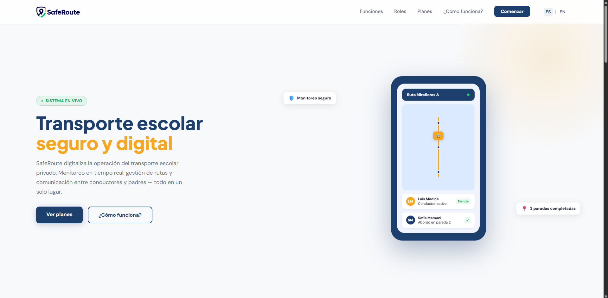
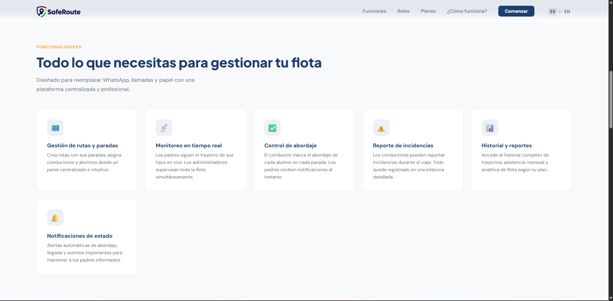
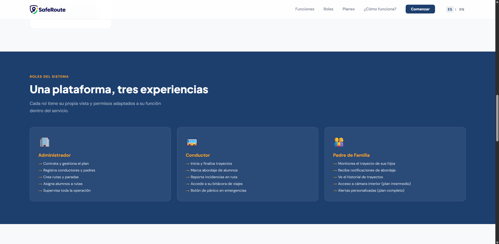
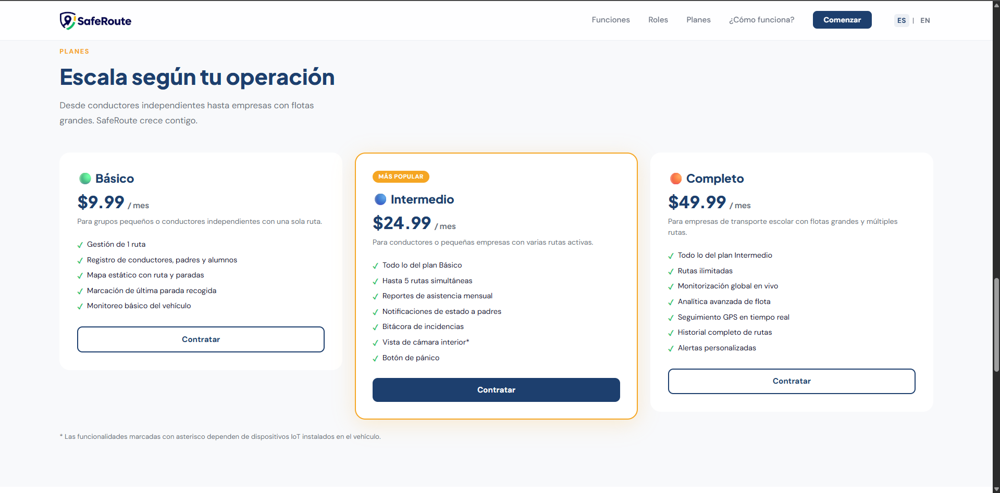
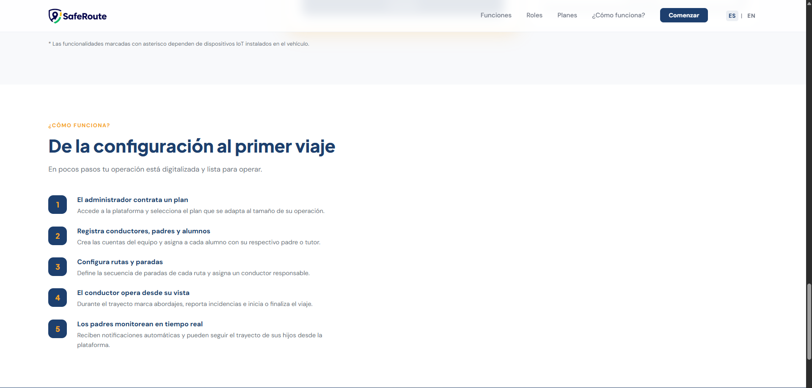
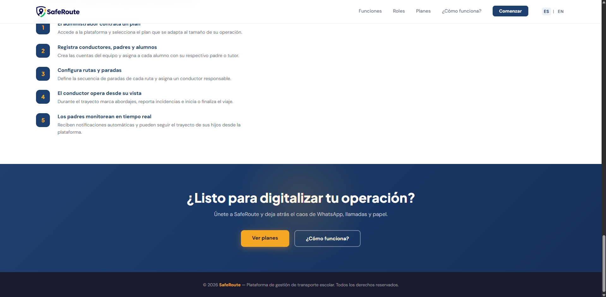
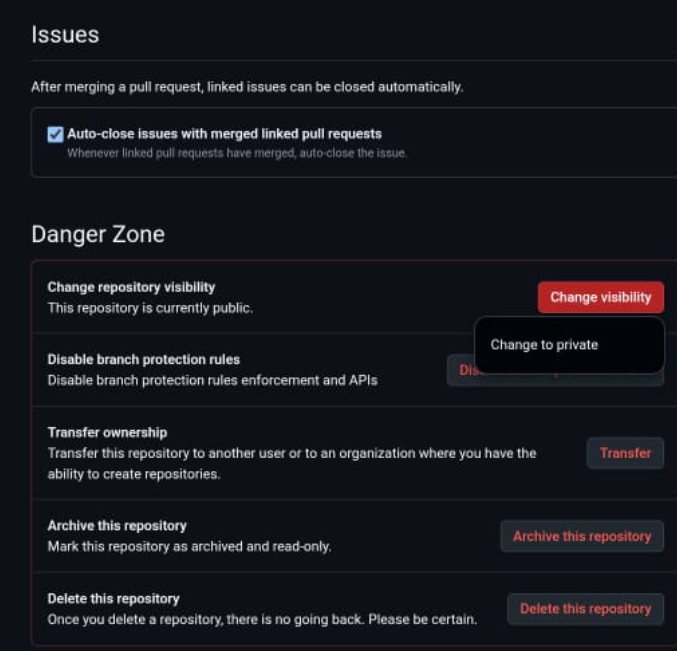
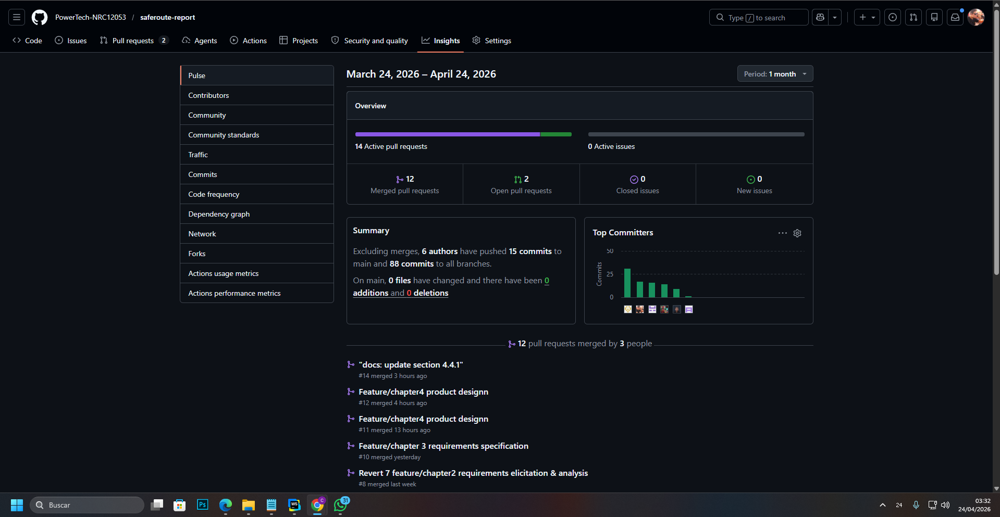

**Nombre de la Universidad:** Universidad Peruana de Ciencias Aplicadas
**Facultad:** Ingeniería  
**Carrera:** Ingeniería de Software
**Ciclo:** 2026-10  

**Código del curso:** 1ASI0730  
**Nombre del curso:** Aplicaciones Web 
**NRC:** 12053  
**Nombre del profesor:** Efraín Ricardo Bautista Ubillús  

**"Informe de Trabajo Final"** 
**Nombre del startup:** PowerTech  
**Nombre del producto:** SafeDrive  

**Relación de integrantes:**

* U202424059 - De La Cruz De Los Santos, Mathias Marcelo
* U202316852 - Ortega Quintana, Jose Zacarias
* U20241D922 - Quispe Serrano, Julio Frank
* U202415551 - Ramirez Ruiz, Nickolas
* U20211D989 - Vallejo Trujillo, Fabio Cesar

##### Abril, 2026

---

## Registro de Versiones del Informe

| Avance | Fecha | Autor | Descripción de Modificación |
| :--- | :--- | :--- | :--- |
| AV1 | --/04/2026 | "-" | "-" |

---

## Project Report Collaboration Insights

El equipo ha utilizado un flujo de trabajo en github: [safedrive-report](https://github.com/FiveTech-NRC11896/safedrive-report)

---

## Contenido

1. [Student Outcome](#student-outcome)
2. [Capítulo I: Introducción](#capítulo-i-introducción)
3. [Capítulo II: Requirements Elicitation & Analysis](#capítulo-ii-requirements-elicitation--analysis)
4. [Capítulo III: Requirements Specification](#capítulo-iii-requirements-specification)
5. [Capítulo IV: Product Design](#capítulo-iv-product-design)
6. [Capítulo V: Product Implementation, Validation & Deployment](#capítulo-v-product-implementation-validation--deployment)
7. [Conclusiones](#conclusiones)
8. [Bibliografía](#bibliografía)

---

## Student Outcome

**ABET - EAC - Student Outcome 5:** Capacidad de funcionar efectivamente en un equipo.

---

## Capítulo I: Introducción

### 1.1. Startup Profile

#### 1.1.1. Descripción de la Startup

FiveTech es una startup de tecnología conformada por estudiantes de Ingeniería de Software de la Universidad Peruana de Ciencias Aplicadas (UPC), orientada al desarrollo de soluciones digitales que resuelven problemas reales en sectores con baja penetración tecnológica. Nació con la convicción de que la seguridad de los niños durante su traslado escolar no debería depender de llamadas telefónicas, mensajes de WhatsApp o registros manuales en papel.
Nuestra propuesta de valor se materializa en SafeRoute, una plataforma web de movilidad institucional inteligente diseñada para digitalizar y optimizar la gestión del transporte escolar. SafeRoute permite a cualquier organización de transporte escolar ya sea un grupo de padres que se organizaron para compartir una movilidad, un conductor independiente o una pequeña empresa del rubro que busquen centralizar la administración de sus rutas, conductores, alumnos y la comunicación en un solo lugar.

#### 1.1.2. Perfiles de integrantes del equipo

|                Foto                 | Apellidos y Nombres         |    Código     | Carrera                | Resumen                                                                                                                                                                                                                                                                                                                                                                                                                                                |
|:-----------------------------------:|:----------------------------|:-------------:| :--------------------- |:-------------------------------------------------------------------------------------------------------------------------------------------------------------------------------------------------------------------------------------------------------------------------------------------------------------------------------------------------------------------------------------------------------------------------------------------------------|
|               ![foto]               | [Apellido 1], [Nombre 1]    | [U20XXXXXXXX] | Ingeniería de Software | [Descripción de conocimientos técnicos y habilidades que aporta al equipo]                                                                                                                                                                                                                                                                                                                                                                             |
|               ![foto]               | [Apellido 2], [Nombre 2]    | [U20XXXXXXXX] | Ingeniería de Software | [Descripción de conocimientos técnicos y habilidades que aporta al equipo]                                                                                                                                                                                                                                                                                                                                                                             |
|   | Quispe Serrano, Julio Frank | [U20241D922]  | Ingeniería de Software | Mi nombre es Julio Frank Quispe Serrano, tengo 20 años,actualmente estoy cursando el 5to ciclo de la carrera de Ingeniería de Software en la Universidad Peruana de Ciencias Aplicadas. Soy un apasionado por la programación, el gym y explorador de música en distintos géneros. Mi aporte en este grupo será el de brindar soluciones prácticas y eficientes ante situaciones de adversidad que estanquen la fluidez de la elaboración del trabajo. |
|  | Ramirez Ruiz, Nickolas      | [U202415551]  | Ingeniería de Software | Soy Nickolas Ramirez Ruiz, estudiante del quinto ciclo de la carrera de Ingeniería de Software. A lo largo de mi formación académica he adquirido conocimientos en programación, principalmente utilizando el lenguaje Java. Me considero una persona organizada, comprometida y con un enfoque proactivo, siempre buscando cumplir con mis responsabilidades antes del tiempo previsto.                                                               |
|               ![foto]               | [Apellido 5], [Nombre 5]    | [U20XXXXXXXX] | Ingeniería de Software | [Descripción de conocimientos técnicos y habilidades que aporta al equipo]                                                                                                                                                                                                                                                                                                                                                                             |

### 1.2. Solution Profile

#### 1.2.1 Antecedentes y problemática

Who (¿Quiénes son los afectados?)
Los afectados son dos grupos claramente identificables. En primer lugar, los padres de familia con hijos en nivel inicial, kínder y primaria que utilizan servicios de transporte escolar privado, quienes no cuentan con información en tiempo real sobre el estado del traslado de sus hijos. En segundo lugar, los conductores de transporte escolar independientes o pertenecientes a pequeñas empresas que gestionan múltiples alumnos y rutas sin herramientas digitales de apoyo.

What (¿Cuál es el problema?)
El transporte escolar privado en el Perú opera en su gran mayoría de forma tradicional y sin soporte tecnológico. La comunicación entre padres y conductores depende de canales no estructurados como llamadas telefónicas y grupos de WhatsApp, lo que genera desorganización, pérdida de información y una sensación constante de incertidumbre en los padres respecto a la seguridad de sus hijos. Por su parte, los conductores y administradores del servicio carecen de herramientas para registrar asistencia, gestionar rutas, reportar incidencias y llevar un historial ordenado de cada trayecto.

Where (¿Dónde ocurre?)
El problema se presenta principalmente en zonas urbanas de Lima Metropolitana, donde la demanda de transporte escolar privado es alta y la oferta opera de manera fragmentada e incluso a veces informal. Sin embargo, la problemática es extensible a cualquier ciudad del Perú con alta densidad de centros educativos privados y colegios que no cuentan con flota propia.

When (¿Cuándo ocurre?)
El problema se manifiesta de forma recurrente durante los horarios de entrada y salida escolar, típicamente entre las 6:00 a.m. y 8:30 a.m., y entre las 12:30 p.m. y 5:00 p.m. Es en estos momentos cuando la falta de información en tiempo real genera mayor ansiedad en los padres y mayor presión operativa en los conductores.

Why (¿Por qué es un problema?)
La ausencia de digitalización en este sector genera consecuencias concretas, por ejemplo los padres no saben si su hijo abordó la movilidad, si llegó al colegio o si ocurrió algún incidente en el camino. Los conductores cometen errores en las paradas, olvidan recoger alumnos o no tienen cómo comunicar retrasos de forma ordenada. Los administradores del servicio pierden tiempo valioso coordinando manualmente lo que podría automatizarse, y no cuentan con registros históricos que les permitan mejorar la operación.

How (¿Cómo se manifiesta?)
Se manifiesta en llamadas y mensajes constantes de padres al conductor durante el trayecto, listas de alumnos escritas en papel o en hojas de cálculo no compartidas, ausencia de registros de incidencias, imposibilidad de verificar el cumplimiento de las paradas, y falta de trazabilidad sobre qué alumnos abordaron o no en cada viaje.

How much (¿Cuál es la magnitud?)
Si bien no existen datos precisos y actualizados que cuantifiquen de forma específica el mercado del transporte escolar privado en el Perú, los indicadores educativos y de transporte disponibles permiten dimensionar la magnitud del problema.
Según el Censo Educativo 2022-2023 del Ministerio de Educación (MINEDU, 2023), en Lima Metropolitana existen aproximadamente 1.9 millones de estudiantes distribuidos en cerca de 7,602 instituciones educativas, de las cuales el 74% son de gestión privada. Esta alta concentración de colegios privados implica que muchas familias dependen de servicios externos de transporte escolar, dado que pocas instituciones cuentan con flotas propias.
Este panorama se ve agravado por una reducción en la oferta formal del servicio. Según la Autoridad de Transporte Urbano para Lima y Callao (ATU, 2024), la cantidad de movilidades escolares autorizadas disminuyó en un 25% en solo un año, lo que sugiere un incremento en la informalidad del sector y, con ello, una mayor ausencia de herramientas de control y monitoreo sobre el servicio que reciben los menores.
Respecto a la seguridad, la Superintendencia de Transporte Terrestre de Personas, Carga y Mercancías (SUTRAN, 2024) ejecutó campañas de sensibilización que alcanzaron a más de 47,000 escolares, evidenciando que la seguridad en el transporte escolar continúa siendo una preocupación activa para las autoridades. Sin embargo, no se dispone públicamente de cifras desagregadas de incidentes específicos en este sector entre 2022 y 2025.

**Figura 1** Distribución de estudiantes de Educación Inicial y Primaria en instituciones privadas y zonas urbanas en el Perú

*Nota.* Adaptado de Resultados del Censo Educativo 2022 (p. 12), por Ministerio de Educación, 2023.

#### 1.2.2 Lean UX Process

##### 1.2.2.1. Lean UX Problem Statements

El transporte escolar privado en el Perú opera mayoritariamente de forma informal, coordinándose mediante llamadas telefónicas, mensajes de WhatsApp y registros manuales en hojas privadas. En este contexto, tanto los padres de familia como los transportistas escolares enfrentan dificultades que comprometen la seguridad y eficiencia del servicio.
Hemos observado un factor crítico que afecta a este ecosistema, los padres de familia no cuentan con visibilidad sobre el trayecto de sus hijos, mientras que los transportistas carecen de herramientas digitales para gestionar rutas, alumnos e incidencias de forma estructurada. Estas dos necesidades son interdependientes, mientras que por un lado los padres necesitan visibilidad, y por el otro los transportistas no tienen los medios para proporcionársela.
¿Cómo podemos desarrollar una plataforma que permita a los transportistas escolares gestionar su operación de forma digital, mientras ofrece simultáneamente a los padres de familia la visibilidad y tranquilidad que necesitan sobre el traslado de sus hijos?

##### 1.2.2.2. Lean UX Assumptions

**Business Assumptions**
- Creemos que existe demanda suficiente para digitalizar el transporte escolar privado en Lima Metropolitana, dado que opera mayoritariamente de forma tradicional y sin soporte tecnológico.
- Creemos que los padres de familia adoptarán la plataforma si el proceso de incorporación es simple y la información que reciben sobre el trayecto de sus hijos es clara y confiable.
- Creemos que los transportistas adoptarán la plataforma si la interfaz operativa durante el trayecto es simple, rápida y no distrae la conducción.
- Creemos que el modelo de suscripción por planes escalonados Básico, Intermedio y Completo permite capturar tanto a grupos pequeños de padres organizados como a empresas de transporte escolar con flotas más grandes.
- Creemos que SafeRoute transmite ahorro de tiempo, reduccion de errores y confianza al transporte de los escolares frente a los padres de familia, lo que justifica el costo de la suscripción.
- Sabremos que estamos equivocados si los administradores abandonan la plataforma en los primeros 60 días por considerar que la curva de aprendizaje es demasiado alta o que el valor percibido no justifica el costo.

**User Assumptions**
- ¿Quién es el usuario? 
Los padres de familia con hijos en nivel inicial, kínder y primaria que utilizan un servicio de transporte escolar ya contratado, y los transportistas escolares  como por ejemplo los conductores independientes o responsables de pequeñas empresas que operan ese servicio. Dentro de la plataforma, cualquiera de estos segmentos puede asumir además el rol de Administrador.
- ¿Dónde encaja nuestro producto en su vida? 
Para el transportista, en su jornada laboral operativa diaria. Para el padre, en los momentos de entrada y salida escolar de sus hijos.
- ¿Qué problemas resuelve? 
Elimina la gestión manual y la comunicación no estructurada del transporte escolar, proporcionando al transportista herramientas operativas digitales y al padre visibilidad del trayecto de sus hijos.
- ¿Cuándo y cómo es usado? 
El transportista lo usa durante cada trayecto para gestionar abordajes, paradas e incidencias. El padre lo consulta en los horarios de traslado escolar para monitorear el estado del viaje de sus hijos.
- ¿Qué características son importantes? 
Registro de abordaje por alumno, visualización de ruta y paradas, reporte de incidencias, historial de trayectos y gestión centralizada de usuarios y rutas.
- ¿Cómo debe verse y comportarse? 
Interfaz limpia, responsiva, rápida y accesible (a11y), disponible en español e inglés (i18n), e intuitiva para usuarios con distintos niveles de familiaridad tecnológica.

##### 1.2.2.3. Lean UX Hypothesis Statements

- Hipótesis 1: "Creemos que lograremos que los padres de familia reduzcan su incertidumbre durante el traslado escolar si ofrecemos a los padres registrados en SafeRoute una vista del estado del trayecto con marcación de abordaje por alumno y visualización de paradas.
Sabremos que esto es verdad cuando veamos que al menos el 70% de los padres activos consulten el estado del trayecto al menos una vez por día durante las primeras 4 semanas de uso."

- Hipótesis 2: "Creemos que lograremos que los transportistas gestionen el trayecto con menos errores y menor carga operativa si ofrecemos a los conductores registrados en SafeRoute una interfaz operativa simple para marcar abordajes, seguir paradas y reportar incidencias durante el viaje.
Sabremos que esto es verdad cuando veamos que el 80% de los trayectos registrados incluyan el check-list de abordaje completado durante las primeras 4 semanas de operación."

- Hipótesis 3: "Creemos que lograremos que los administradores centralicen la gestión de su servicio en SafeRoute si ofrecemos a los administradores del plan Básico un panel único para registrar usuarios, conductores, hijos, asignaciones y rutas. Sabremos que esto es verdad cuando veamos que al menos el 75% de los administradores registren la totalidad de sus usuarios y rutas dentro de los primeros 15 días tras el onboarding."

- Hipótesis 4: "Creemos que lograremos que los administradores escalen su plan de suscripción si demostramos a los administradores de los planes inferiores que las funcionalidades de los plan superiores reducen significativamente el tiempo de coordinación del servicio. Sabremos que esto es verdad cuando veamos que al menos el 20% de los administradores de los planes Básico o Intermedio actualicen al algun plan superior dentro de los primeros 3 meses de uso."

##### 1.2.2.4. Lean UX Canvas

| Sección | Contenido |
| :----- | :--------- |
| 1. Business Problem | El transporte escolar privado en el Perú opera de forma tradicional y sin soporte tecnológico. Los padres no tienen visibilidad sobre el trayecto de sus hijos y los transportistas gestionan su operación con llamadas, WhatsApp y hojas privadas, lo que genera errores, ineficiencia y una experiencia de servicio poco confiable.|
| 2. Business Outcomes| Lograr que el 75% de administradores completen el registro de su operación en los primeros 15 días. Retener al 80% de suscriptores activos durante los primeros 3 meses. Alcanzar una tasa de upgrade del plan Básico al Intermedio del 20% en los primeros 3 meses de uso.|
| 3. Users | Los segmentos que interactúan con SafeRoute son los padres de familia con hijos en nivel inicial, kínder y primaria que utilizan un servicio de transporte escolar ya contratado, y los transportistas escolares conductores independientes o responsables de pequeñas empresas que operan ese servicio. Cualquiera de estos puede asumir además el rol de Administrador dentro de la plataforma.|
| 4. User Outcomes & Benefits | Los padres buscan reducir su incertidumbre sobre el trayecto de sus hijos, pudiendo monitorear el estado del viaje sin necesidad de interrumpir al conductor. Los transportistas buscan gestionar rutas, alumnos e incidencias de forma digital, reduciendo errores operativos y proyectando mayor profesionalismo frente a las familias. Quienes asumen el rol de administrador buscan centralizar toda la operación del servicio en un solo panel, eliminando la coordinación manual y el uso de herramientas desconectadas.|
| 5. Solution Ideas | Ofrecemos un panel de administración de usuarios, conductores, hijos y rutas. Tambien, Check-list de abordaje digital por conductor. Vista de paradas y estado del trayecto para padres. Registro de incidencias por ruta. Historial de trayectos por comunidad de ruta. Seguimiento GPS en tiempo real (plan Completo). Apertura a integración IoT futura.|
| 6. Hypotheses | - Si ofrecemos a los padres una vista de estado del trayecto, al menos el 70% la consultará diariamente en las primeras 4 semanas.  - Si ofrecemos al conductor una interfaz operativa simple, el 80% de los trayectos tendrán el check-list completado en las primeras 4 semanas.  - Si ofrecemos al administrador un panel único de gestión, el 75% completará su registro en los primeros 15 días.  - Si demostramos el valor del plan Intermedio, el 20% de administradores del plan Básico harán upgrade en los primeros 3 meses.|
| 7. What's the most important thing we need to learn first? | ¿El administrador del servicio percibe suficiente valor en SafeRoute como para abandonar los métodos informales actuales y pagar una suscripción mensual?|
| 8. What's the least amount of work we need to do to learn the next most important thing? | Realizar entrevistas con 3 a 5 administradores de servicios de transporte escolar (padres representantes o transportistas independientes) para validar su disposición al cambio y las funcionalidades que consideran imprescindibles antes de desarrollar el MVP.|

### 1.3. Segmentos objetivo

SafeRoute está dirigido a dos segmentos que forman parte del ecosistema del transporte escolar privado en Lima Metropolitana.

- **Segmento 1: Padres de Familia**
El primer segmento está conformado por padres de familia o apoderados con hijos en nivel inicial, kínder y primaria que utilizan un servicio de transporte escolar privado ya contratado. Se trata de personas que han delegado el traslado de sus hijos a un tercero y que, durante el trayecto, no cuentan con información estructurada sobre el estado del viaje. Este segmento no está delimitado por un nivel socioeconómico específico, sino por la condición de tener hijos en edad escolar que usan transporte privado y de contar con acceso a internet desde un dispositivo con navegador web. Su principal motivación al usar SafeRoute es, precisamente, reducir la incertidumbre que genera no saber si sus hijos abordaron con seguridad, en qué parte del recorrido se encuentran o si ocurrió alguna novedad durante el viaje.

- **Segmento 1: Transportistas Escolares**
El segundo segmento está conformado por las personas o entidades que operan el servicio de transporte escolar privado. Dentro de este segmento conviven tres perfiles distintos. El primero corresponde a personas independientes que ofrecen el servicio de forma autónoma. El segundo agrupa a conductores que han sido asignados para operar una movilidad organizada por un conjunto de familias. El tercero engloba a los responsables de pequeñas empresas de transporte escolar que cuentan con una flota de vehículos y conductores a su cargo. A pesar de sus diferencias, todos comparten un factor común, pues operan sin herramientas digitales especializadas, apoyándose en métodos manuales e informales para gestionar una actividad que involucra directamente la seguridad de menores. Por ello, su principal motivación al usar SafeRoute es digitalizar y profesionalizar su operación, reducir los errores en la gestión de rutas y alumnos, y ofrecer a las familias que atienden una experiencia de servicio más confiable y transparente.

---

## Capítulo II: Requirements Elicitation & Analysis

### 2.1. Competidores

#### 2.1.1. Análisis competitivo

#### 2.1.2. Estrategias y tácticas frente a competidores

### 2.2. Entrevistas

#### 2.2.1. Diseño de entrevistas

#### 2.2.2. Registro de entrevistas

#### 2.2.3. Análisis de entrevistas

### 2.3. Needfinding

#### 2.3.1. User Personas

#### 2.3.2. User Task Matrix

#### 2.3.3. User Journey Mapping

#### 2.3.4. Empathy Mapping

### 2.4. Big Picture Event Storming

### 2.5. Ubiquitous Language

---

## Capítulo III: Requirements Specification

### 3.1. User Stories

### 3.2. Impact Mapping

### 3.3. Product Backlog

---

## Capítulo IV: Product Design

### 4.1. Style Guidelines

#### 4.1.1. General Style Guidelines

#### 4.1.2. Web Style Guidelines

### 4.2. Information Architecture

#### 4.2.1. Organization Systems

#### 4.2.2. Labeling Systems

#### 4.2.3. SEO Tags and Meta Tags

#### 4.2.4. Searching Systems

#### 4.2.5. Navigation Systems

### 4.3. Landing Page UI Design

#### 4.3.1. Landing Page Wireframe

#### 4.3.2. Landing Page Mock-up

### 4.4. Web Applications UX/UI Design

#### 4.4.1. Web Applications Wireframes

#### 4.4.2. Web Applications Wireflow Diagrams

#### 4.4.2. Web Applications Mock-ups

#### 4.4.3. Web Applications User Flow Diagrams

### 4.5. Web Applications Prototyping

### 4.6. Domain-Driven Software Architecture

#### 4.6.1. Design-Level Event Storming

#### 4.6.2. Software Architecture Context Diagram

#### 4.6.3. Software Architecture Container Diagrams

#### 4.6.4. Software Architecture Components Diagrams

### 4.7. Software Object-Oriented Design

#### 4.7.1. Class Diagrams

### 4.8. Database Design

#### 4.8.1. Database Diagrams

---

## Capítulo V: Product Implementation, Validation & Deployment

### 5.1. Software Configuration Management

#### 5.1.1. Software Development Environment Configuration

En esta sección se describen las herramientas y tecnologías utilizadas para el desarrollo del proyecto.

##### UX/UI Design

* **Figma**  
  Herramienta de diseño colaborativo utilizada para la creación de wireframes, mockups, prototipos y diseño de interfaces de usuario. Permite trabajar en equipo en tiempo real, facilitando la validación temprana de la experiencia del usuario.

---

##### Software Development

* **JetBrains Rider**  
  Entorno de desarrollo integrado (IDE) utilizado para el desarrollo del backend en C#.

* **Visual Studio Code**  
  Editor de código ligero utilizado como herramienta complementaria para el desarrollo frontend y edición de archivos del proyecto.

* **GitHub**  
  Plataforma de control de versiones utilizada para la gestión del código fuente y colaboración del equipo, implementando la metodología GitFlow para la organización del desarrollo.

* **HTML**  
  Lenguaje de marcado utilizado para la estructura de las interfaces web.

* **CSS**  
  Lenguaje de estilos utilizado para la presentación visual de la aplicación.

* **JavaScript (Vue.js)**  
  Framework utilizado para el desarrollo del frontend, permitiendo la creación de interfaces dinámicas e interactivas.

* **C#**  
  Lenguaje de programación utilizado para el desarrollo del backend de la aplicación.

---

### Software Deployment

* **GitHub Pages**  
  Servicio utilizado para el despliegue de la landing page del proyecto.

* **Vercel**  
  Plataforma utilizada para el despliegue del frontend desarrollado en Vue.js, permitiendo una integración continua y despliegue automatizado.

* **Railway**  
  Plataforma utilizada para el despliegue de servicios backend y APIs, facilitando la conexión entre frontend y backend en un entorno accesible en la nube.

#### 5.1.2. Source Code Management

Para el manejo del código fuente, utilizamos GitHub para colaborar entre miembros de equipo en multiples repositorios. A continuación se listan los enlaces de cada repositorio utilizado.

* Organización: <https://github.com/PowerTech-NRC12053>
* Repositorio de Landing Page: <https://github.com/PowerTech-NRC12053/safedrive-landing-page>
* Repositorio del informe: <https://github.com/PowerTech-NRC12053/safedrive-report>
* Repositorio del frontend: <https://github.com/PowerTech-NRC12053/safedrive-frontend-applications>
* Repositorio del backend: <https://github.com/PowerTech-NRC12053/safedrive-web-services>

En el repositorio del informe se seguirá un esquema de trabajo basado en GitFlow. La rama main almacenará la versión estable del informe correspondiente a cada entregable del trabajo, mientras que la rama develop concentrará la integración de avances validados por cada integrante antes de su consolidación final. A partir de develop, cada integrante creará ramas feature de trabajo para las secciones asignadas. Las ramas feature seguirán una nomenclatura asociada al capítulo o bloque trabajado, por ejemplo: feature/chapter-1-introduction-and-lean-ux, o feature/chapter-5-software-configuration-management. Esta convención permite identificar con claridad qué parte del informe está siendo desarrollada y reduce el riesgo de conflictos entre los miembros del equipo.

En los repositorios del Landing Page, Frontend y Backend también se utilizará GitFlow. En cada uno de ellos, la rama main contendrá las versiones estables del producto y la rama develop servirá como rama de integración del trabajo colaborativo. A partir de develop, se crearán ramas feature/... para el desarrollo de funcionalidades específicas. A diferencia del informe, en estos repositorios las ramas no estarán organizadas por capítulos, sino por funcionalidades o componentes del sistema. Algunos ejemplos de nomenclatura son: feature/home-page, feature/dashboard o feature/route-management. Esta convención nos permite que las ramas reflejen de manera directa el alcance funcional del producto en desarrollo.

No se realizarán cambios directos sobre la rama main, ya que esta representará únicamente versiones estables y listas para consolidarse como parte de un entregable. Del mismo modo, se evitará que los integrantes trabajen de forma continua directamente sobre la rama develop, ya que el flujo previsto consiste en desarrollar primero en ramas feature, integrar luego en develop y finalmente consolidar en main cuando el avance haya sido revisado y validado. Por tanto, el flujo general de trabajo será de la siguiente forma: feature → develop → main. Este esquema se alinea con la exigencia del curso de explicar la implementación de GitFlow mediante ramas principales, ramas de features, y convenciones para releases y hotfixes.

Asimismo, si se requiere corregir errores críticos sobre una versión estable, se podrán crear ramas hotfix/..., y si se decide preparar una versión de cierre antes de una entrega, se utilizarán ramas release/... de acuerdo con el flujo definido por GitFlow.

En relación con los mensajes de cada commit, el equipo aplicará Conventional Commits para mantener un historial más legible, consistente y profesional. Esta convención facilitará la revisión de avances y permitirá identificar rápidamente el propósito de cada uno de los cambios. Algunos prefijos que se utilizarán son:

* feat: incorporación de una nueva funcionalidad
* fix: corrección de errores
* docs: cambios en documentación
* style: cambios de formato o estilo sin alterar lógica
* refactor: reorganización interna sin agregar funcionalidad nueva
* test: incorporación o ajuste de pruebas
* chore: tareas de mantenimiento o configuración

Para el repositorio del informe se emplearán mensajes como docs(report): add project cover page o docs: add startup profile and lean ux process for chapter 1. Para los repositorios de software se utilizarán mensajes como feat: add school route registration, feat: implement student assignment to route o fix: correct login validation. Esta práctica contribuye a que la evidencia de commits sea coherente con el trabajo realizado por cada miembro

#### 5.1.3. Source Code Style Guide & Conventions

En esta sección se definen las convenciones de nombres y codificación adoptadas por el equipo para los lenguajes utilizados en el proyecto: HTML, CSS, JavaScript (Vue.js) y C#.

### Principios generales

* **Idioma estándar:** Todo el código fuente se desarrolla en inglés, incluyendo nombres de variables, funciones, clases, archivos y la documentación del código.
* **Legibilidad:** Se prioriza el uso de nombres descriptivos y claros, evitando abreviaciones innecesarias.
* **Consistencia:** Se mantiene un estilo uniforme en todo el proyecto para facilitar el trabajo colaborativo.
* **Nombres semánticos:**  
  * Sustantivos para clases y componentes.  
  * Verbos para funciones y métodos.
  
---

### HTML

* Los archivos terminan en `.html`.
* Se utilizan etiquetas semánticas como:
  * `<header>`, `<nav>`, `<section>`, `<article>`, `<footer>`.
* Se emplean atributos descriptivos para mejorar la accesibilidad (`alt`, `aria-*`).
* Estructura clara y ordenada para facilitar mantenimiento.

---

### CSS

* Los archivos terminan en `.css`.
* Las clases se nombran en **kebab-case**:
  * `.main-header`, `.route-card`, `.student-list`.
* Se mantiene consistencia visual mediante estilos reutilizables.

---

### JavaScript (Vue.js)

* Los archivos terminan en `.js`.
* Se utiliza **camelCase** para variables y funciones:
  * `getRoutes`, `calculateDistance`.
* Se prioriza el uso de `const` y `let`, evitando `var`.
* Los componentes de Vue siguen una estructura modular y reutilizable.
* Se mantiene separación clara entre lógica, presentación y datos.
* Se utilizan nombres descriptivos para props, métodos y eventos.

---

### C#

* Se sigue la convención estándar de **PascalCase**:
  * Clases: `StudentService`, `RouteController`.
  * Métodos: `GetStudents()`, `CreateRoute()`.
* Variables locales en **camelCase**:
  * `studentList`, `routeId`.
* Uso de sufijos por responsabilidad:
  * `Controller`, `Service`, `Repository`.
* Se mantiene una arquitectura organizada por capas (por ejemplo: Controllers, Services, Models).
* Se aplican buenas prácticas como separación de responsabilidades y reutilización de código.

---

#### 5.1.4. Software Deployment Configuration

En esta sección se describe la configuración necesaria para el despliegue de los principales componentes del proyecto: Landing Page, Frontend Web Application y Backend.

##### Despliegue de Landing Page

La Landing Page fue desarrollada utilizando HTML, CSS y JavaScript, y será desplegada mediante GitHub Pages, un servicio de hosting para sitios estáticos.

###### Pasos de despliegue

1. Crear un repositorio en GitHub destinado a la landing page.
2. Subir el código fuente (HTML, CSS, JS y recursos estáticos) al repositorio.
3. Asegurar que el archivo principal se denomine `index.html` y se encuentre en la raíz del proyecto.
4. Acceder a la sección **Settings > Pages** del repositorio.
5. Seleccionar la rama `main` (o `master`) y la carpeta raíz (`/`) como fuente.
6. GitHub generará automáticamente una URL pública para acceder a la landing page.

**URL desplegada:** Pendiente

---

##### Despliegue de Frontend Web Application

El frontend de la aplicación, desarrollado con Vue.js, será desplegado utilizando la plataforma Vercel, la cual permite integración continua y despliegue automatizado.

###### Pasos de despliegue

1. Crear o seleccionar el repositorio del frontend en GitHub.
2. Vincular el repositorio con la plataforma Vercel.
3. Configurar el entorno de despliegue (framework Vue.js).
4. Ejecutar el despliegue automático desde Vercel.
5. Obtener la URL pública generada para el acceso a la aplicación.
 
**URL desplegada:** Pendiente

---

### Despliegue de Backend Services

El backend del sistema, desarrollado en C#, será desplegado utilizando Railway, una plataforma que permite exponer servicios y APIs en la nube.

#### Pasos de despliegue:

1. Crear el repositorio del backend en GitHub.
2. Vincular el repositorio con Railway.
3. Configurar las variables de entorno necesarias para la ejecución del backend.
4. Configurar el servicio para exponer endpoints API.
5. Desplegar el servicio y obtener la URL pública del backend.

**URL desplegada:** Pendiente

---

### 5.2. Landing Page, Services & Applications Implementation

#### 5.2.1. Sprint 1

##### 5.2.1.1. Sprint Planning 1
En la reunión de planificación del Sprint 1, el equipo definió como objetivo principal establecer la presencia digital de SafeRoute y la estructura base del sistema.

| Sprint # | Sprint 1 |
|----------|----------|
| **Sprint Planning Background** | |
| **Date** | 2026-04-06 |
| **Time** | 14:30 PM (GMT-5) |
| **Location** | Modalidad remota mediante la plataforma Discord |
| **Prepared By** | Ramirez Ruiz, Nickolas |
| **Attendees (to planning meeting)** | De La Cruz, Mathias / Ortega, José / Quispe, Julio / Ramirez, Nickolas / Vallejo, Fabio |
| **Sprint 0 Review Summary** | N/A - Sprint inicial enfocado en la definición del modelo de negocio y perfiles de usuario. |
| **Sprint 0 Retrospective Summary** | N/A - Configuración inicial de la organización en GitHub y Trello. |
| **Sprint Goal & User Stories** | |
| **Sprint 1 Goal** | **Nuestro propósito es** diseñar y desplegar la versión inicial de la Landing Page de SafeRoute e implementar la estructura base del backend bajo DDD. **Creemos que esto aportará** visibilidad clara de nuestra solución a padres y transportistas. **Esto se confirmará cuando** la Landing Page sea accesible públicamente y se valide el primer endpoint del Shared Kernel. |
| **Sprint 1 Velocity** | 22 Story Points |
| **Sum of Story Points** | 22 Story Points |

##### 5.2.1.2. Aspect Leaders and Collaborators
De acuerdo a la especialización de cada integrante en la esquematización del proyecto, se presenta la Leadership-and-Collaboration Matrix (LACX):<table>

| Team Member (Last Name, First Name) | GitHub Username | UX/UI Design (L/C) | Backend Architecture (L/C) | Landing Page (L/C) | Documentation (L/C) |
|-------------------------------------|-----------------|-------------------|---------------------------|-------------------|---------------------|
| Quispe Serrano, Julio Frank | FraSe_JQ | C | C | L | C |
| Ortega Quintana, José Zacarías | AgoxX61 | L | C | C | C |
| De La Cruz, Mathias Marcelo | Dela050406 | C | C | L | C |
| Vallejo Trujillo, Fabio Cesar | fabiovallejo | C | L | C | C |
| Ramirez Ruiz, Nickolas | Bynickram02 | C | C | C | L |

### **5.2.1.3. Sprint Backlog 1**

**Objetivo del Sprint:**
Establecer la infraestructura base de SafeRoute mediante el desarrollo de una Landing Page bilingüe que comunique la propuesta de valor, la implementación del sistema de gestión de usuarios (padres, conductores y alumnos) y la configuración de los servicios de geolocalización esenciales para el monitoreo de rutas.

**Board de Trello :**
*( captura )*

**URL del Board:** [ enlace ]

| US Id | User Story Title        | Task Id | Task Title | Description | Estimation (Hours) | Assigned To | Status |
| :--- |:------------------------| :--- | :--- | :--- | :--- | :--- | :--- |
| **US25** | Visualización de Hero   | T01 | Setup de Landing & Hero | Maquetar la sección principal con la propuesta de valor en Vue.js. | 8 | Fabio | To-do |
| **US30** | Implementación i18n     | T02 | Configuración i18n | Implementar Vue-i18n y diccionarios para soporte ES/EN. | 12 | Mathias | To-do |
| **US19** | Alerta de Proximidad    | T03 | Lógica de Geofencing | Desarrollar el algoritmo de proximidad (500m) en el backend. | 14 | Mathias | To-do |
| **US1** | Contratar Plan          | T04 | API de Suscripciones | Crear endpoints para selección de planes y validación de límites. | 12 | Nickolas | To-do |
| **US5** | Creación de Rutas       | T05 | Módulo de Trazado | Implementar lógica para definir puntos A/B y paradas intermedias. | 16 | Nickolas | To-do |
| **US6** | Asignación de Roles     | T06 | Gestión de Permisos | Desarrollar la lógica de vinculación Conductor-Ruta-Vehículo. | 10 | Nickolas | To-do |
| **US23** | Sección ¿Cómo funciona? | T07 | Onboarding Visual | Crear el componente de infografía interactiva en la Landing. | 6 | Nickolas | To-do |
| **US4** | Alta de Alumnos         | T08 | CRUD Alumnos | Implementar el registro de menores y almacenamiento de fotos. | 10 | Nickolas | To-do |
| **US22** | Consulta de Precios     | T09 | Tabla de Planes | Maquetar la sección de costos y descuentos anuales en la web. | 8 | Chris | To-do |
| **US2** | Registro de Conductores | T10 | Registro de Flota | Desarrollar validaciones de licencia y creación de cuentas driver. | 12 | Chris | To-do |
| **US3** | Registro de Padres      | T11 | Gestión de Apoderados | Implementar el flujo de invitaciones y registro de padres. | 10 | Renzo | To-do |
| **US14** | Finalización de Ruta    | T12 | Cierre de Sesión Operativa | Lógica para detener GPS y validar que el bus esté vacío al finalizar. | 8 | Renzo | To-do |
| **US25** | API: Registro GPS       | T13 | Ingesta de Coordenadas | Desarrollar el endpoint de alta frecuencia para recibir datos GPS. | 15 | Fabio | To-do |
| **US8** | Inicio de Trayecto      | T14 | Activación de Ruta | Implementar el trigger que notifica el inicio del viaje a los padres. | 8 | Fabio | To-do |
| **---** | **Constraint General**  | T15 | Setup Arquitectónico | Configuración de BD SQL Server y estructura modular en C#. | 12 | Chris | To-do |

##### 5.2.1.4. Development Evidence for Sprint Review

Durante el Sprint 1, el equipo realizó commits principalmente sobre el repositorio del informe (SafeRoute-report), abarcando la documentación de los capítulos I al V, incluyendo el diseño de producto, arquitectura de software, wireframes, mockups y la configuración del entorno de desarrollo.

| Repository       | Branch                                       | Commit Id | Commit Message                                                                 | Committed By  | Date       |
|------------------|----------------------------------------------|-----------|--------------------------------------------------------------------------------|---------------|------------|
| SafeRoute-report | develop                                      | ec0d2ce   | Initial commit                                                                 | SafeDriveTech | 2026-04-06 |
| SafeRoute-report | develop                                      | 2bb2eef   | docs: initial report                                                           | FraSe-JQ      | 2026-04-07 |
| SafeRoute-report | develop                                      | 45ec948   | docs: add startup profile and lean ux process for chapter 1                    | FraSe-JQ      | 2026-04-10 |
| SafeRoute-report | develop                                      | 5f04c0e   | docs(report): add project cover page                                           | fabiovallejo  | 2026-04-10 |
| SafeRoute-report | develop                                      | 1c099f8   | docs: add deployment section (5.1.4)                                           | fabiovallejo  | 2026-04-10 |
| SafeRoute-report | develop                                      | aaadbc7   | docs(team): add personal profile and photo                                     | Bynickram02   | 2026-04-23 |
| SafeRoute-report | develop                                      | 03ab198   | docs(chapter-5): ##### 5.2.1.1. Sprint Planning 1                              | Bynickram02   | 2026-04-23 |
| SafeRoute-report | develop                                      | bd757c0   | docs(chapter-5): add update 5.2.1.1. Sprint Planning 1                         | Bynickram02   | 2026-04-23 |
| SafeRoute-report | develop                                      | 236cc21   | docs(chapter-5): add 5.2.1.2. Aspect Leaders and Collaborators                 | Bynickram02   | 2026-04-23 |
| SafeRoute-report | develop                                      | 6163f14   | docs(chapter-5): add 5.2.1.3. Sprint Backlog 1                                 | Bynickram02   | 2026-04-23 |
| SafeRoute-report | develop                                      | 73494b0   | docs(chapter-5): update 5.2.1.3. Sprint Backlog 1                              | Bynickram02   | 2026-04-23 |
| SafeRoute-report | feature/chapter-3-Requirements-Specification | 225a479   | chore: restruct images assets                                                  | Dela050406    | 2026-04-22 |
| SafeRoute-report | feature/chapter4-ddd-architecture            | 84c85f7   | add: diagrams C4 and details                                                   | FraSe-JQ      | 2026-04-21 |
| SafeRoute-report | feature/chapter4-ProductDesignn              | c040825   | docs: modify section Web Style Guidelines                                      | Dela050406    | 2026-04-19 |
| SafeRoute-report | feature/chapter4-ProductDesignn              | f7930e2   | docs: add Landing Page Wireframes                                              | Dela050406    | 2026-04-19 |
| SafeRoute-report | feature/chapter4-ProductDesignn              | 972597e   | docs: add section 4.3.2 section Landing Page Mock-up                           | Dela050406    | 2026-04-19 |
| SafeRoute-report | feature/chapter4-ProductDesignn              | f48cfbe   | docs: update mockup                                                            | Dela050406    | 2026-04-19 |
| SafeRoute-report | feature/chapter4-ProductDesignn              | ca0f82d   | docs: add mobile wireframes in section 4.3.1 and update wireframes             | Dela050406    | 2026-04-19 |
| SafeRoute-report | feature/chapter4-ProductDesignn              | 9edd809   | docs: add mockup mobile in section 4.3.2                                       | Dela050406    | 2026-04-19 |
| SafeRoute-report | feature/chapter4-ProductDesignn              | 40074e4   | docs: modified some concept about wireframes and mock-ups                      | Dela050406    | 2026-04-19 |
| SafeRoute-report | feature/chapter4-ProductDesignn              | d855868   | docs: modify section 4.3.2 Landing Page Mock-up                                | Dela050406    | 2026-04-20 |
| SafeRoute-report | feature/chapter4-ProductDesignn              | c3ca181   | docs: update section 4.4.1                                                     | Dela050406    | 2026-04-23 |
| SafeRoute-report | feature/chapter4-ProductDesignn              | e3d18b0   | docs: add section 4.4.2 Web Application Mockups Desktop and Mobile             | Dela050406    | 2026-04-23 |
| SafeRoute-report | feature/chapter4-ProductDesignn              | b6dfac2   | docs: update wireframe                                                         | Dela050406    | 2026-04-23 |
| SafeRoute-report | feature/chapter4-ProductDesignn              | 87839ff   | docs: update Mockups and Wireframes WebApp                                     | Dela050406    | 2026-04-24 |
| SafeRoute-report | develop                                      | 96e3eed   | docs: added web applications desktop wireframes for chapter 4                  | fabiovallejo  | 2026-04-24 |
| SafeRoute-report | develop                                      | 9f0afc8   | docs: added universal mobile wireframes for chapter 4                          | fabiovallejo  | 2026-04-24 |
| SafeRoute-report | develop                                      | fadb83a   | add software architecture and database design diagrams for chapter 4           | FraSe-JQ      | 2026-04-20 |
| SafeRoute-report | develop                                      | a363651   | change: URL                                                                    | FraSe-JQ      | 2026-04-20 |
| SafeRoute-report | develop                                      | b2a7212   | change Diagrams                                                                | FraSe-JQ      | 2026-04-20 |
| SafeRoute-report | develop                                      | 32b401f   | docs(chapter-5): update add 5.2.1.1. Sprint Planning 1                         | Bynickram02   | 2026-04-24 |
| SafeRoute-report | develop                                      | f83a826   | docs(chapter-5): update add 5.2.1.2. Aspect Leaders and Collaborators 1        | Bynickram02   | 2026-04-24 |

* Por el momento el avance es ese, en proximos avances se ira enriqueciendo los commits y la estructura del trabajo.

##### 5.2.1.5. Execution Evidence for Sprint Review

Durante el Sprint 1, el equipo logró diseñar y desplegar la primera versión pública de la Landing Page de SafeRoute, accesible en [https://powertech-nrc12053.github.io/saferoute-website/](https://powertech-nrc12053.github.io/saferoute-website/).

La Landing Page presenta la propuesta de valor del producto, las funcionalidades principales, los roles del sistema, los planes de suscripción y el flujo de uso, con soporte de internacionalización (ES/EN). A continuación se presentan las capturas de las secciones implementadas.

**Sección Hero**

Se implementó la sección principal con el mensaje de valor "Transporte escolar seguro y digital", una ilustración del sistema en funcionamiento y dos botones de llamada a la acción: "Ver planes" y "¿Cómo funciona?". 
El navbar incluye navegación a las secciones principales y el selector de idioma ES/EN.

---

**Sección Funcionalidades**

Se implementó la sección "Todo lo que necesitas para gestionar tu flota", presentando las seis funcionalidades principales de la plataforma mediante tarjetas con ícono y descripción: Gestión de rutas y paradas, Monitoreo en tiempo real, Control de abordaje, Reporte de incidencias, Historial y reportes, y Notificaciones de estado.

---

**Sección Roles del Sistema**

Se implementó la sección "Una plataforma, tres experiencias", que presenta las vistas y permisos diferenciados para los tres perfiles del sistema: Administrador, Conductor y Padre de Familia, cada uno con su lista de funciones disponibles.

---

**Sección Planes**

Se implementó la sección "Escala según tu operación", que presenta los tres planes de suscripción disponibles: Básico (9.99 dolares/mes), Intermedio (24.99 dolares/mes) y Completo (49.99 dolares/mes),
con sus respectivas funcionalidades y botones de contratación.

 
---

**Sección ¿Cómo funciona?**

Se implementó la sección "De la configuración al primer viaje", que presenta en cinco pasos el flujo completo de uso de la plataforma: desde la contratación del plan por el administrador hasta el monitoreo en tiempo real por parte de los padres.

 
---
**Sección Call to Action y Footer**

Se implementó la sección final de cierre "¿Listo para digitalizar tu operación?", con botones de conversión hacia los planes y la sección de cómo funciona, junto con el footer de la plataforma.

##### 5.2.1.6. Services Documentation Evidence for Sprint Review

Durante el Sprint 1, el equipo se enfocó en el diseño y despliegue de la Landing Page de SafeRoute, así como en la documentación de la arquitectura base del sistema bajo el enfoque Domain-Driven Design (DDD). En consecuencia, no se implementaron ni desplegaron servicios web (Web Services / RESTful API) durante este sprint.
La documentación de endpoints, contratos de API y evidencia de consumo de servicios será abordada a partir del Sprint 3, una vez que se inicie la implementación del backend en ASP.NET Core.

| Recurso      | Acción implementada   | Método HTTP | URL / Endpoint | Link de repositorio                                        |
|--------------|-----------------------|-------------|------------|------------------------------------------------------------|
| Landing Page | Visualización inicial | GET         |            | https://github.com/PowerTech-NRC12053/saferoute-report.git |
##### 5.2.1.7. Software Deployment Evidence for Sprint Review

Durante el Sprint 1 se realizó el despliegue de la Landing Page de SafeRoute
utilizando GitHub Pages como plataforma de hosting estático.

1. Se activó GitHub Pages en el repositorio `saferoute-website`, configurando
   la rama `main` como fuente de publicación.

   

2. Se verificó la accesibilidad pública de la Landing Page.
   **URL:** 

https://powertech-nrc12053.github.io/saferoute-website/

   

##### 5.2.1.8. Team Collaboration Insights during Sprint

---

## Conclusiones

### Conclusiones y recomendaciones

**Conclusiones**

- El Sprint 1 permitió consolidar la identidad visual y comunicacional de SafeRoute mediante el despliegue de la Landing Page, logrando presentar de forma clara la propuesta de valor del producto a los segmentos objetivo. La implementación de secciones como Hero, Funcionalidades, Roles y Planes demostró que el equipo tiene una visión coherente del producto, alineada con los problemas identificados en el levantamiento de requerimientos.

- La elaboración de los wireframes y mockups tanto en versión desktop como mobile para los tres perfiles de usuario (Administrador, Conductor y Padre de Familia) evidencia un diseño centrado en el usuario que anticipa los flujos críticos del sistema. Este trabajo de diseño previo representa una base sólida que reducirá el tiempo de desarrollo del frontend en los siguientes sprints al tener ya definidas las interfaces y la lógica de navegación.

- La adopción de Domain-Driven Design como enfoque arquitectónico del backend permitió al equipo identificar y documentar correctamente los seis bounded contexts del sistema (IAM, Subscriptions, Stakeholders, Fleet, Trip y Notifications), estableciendo contratos claros entre dominios que facilitarán la implementación progresiva del backend en ASP.NET Core a partir del Sprint 2.

**Recomendaciones**

- Se recomienda mantener el repositorio actualizado conforme avance cada sprint, evitando acumular secciones pendientes para el último momento y reduciendo la carga de trabajo en las semanas de entrega.

- Se recomienda que el equipo establezca una rutina de revisión de pull requests entre pares antes de mergear cualquier rama feature a develop,
con el objetivo de reducir errores de integración, mantener la consistencia del informe y asegurar que todos los integrantes estén alineados con el avance general del proyecto.

- Se recomienda iniciar las entrevistas con usuarios reales del segmento objetivo (padres de familia y transportistas) a la brevedad, 
con el fin de validar las hipótesis planteadas en el Lean UX Canvas y ajustar las funcionalidades del producto antes de invertir mayor esfuerzo de desarrollo en el frontend y backend.

### Video About-the-Team

## Bibliografía

- Autoridad de Transporte Urbano para Lima y Callao. (2024). *Cifra de movilidades escolares autorizadas disminuyó en 25% en un año*. El Comercio. Recuperado el 9 de abril de 2026, de https://elcomercio.pe/lima/cifra-de-movilidades-escolares-autorizadas-disminuyo-en-25-en-un-ano-a-que-se-debe-esta-reduccion-informe-movilidad-escolar-noticia/

- Ministerio de Educación. (2023). *Resultados del Censo Educativo 2022*. ESCALE. Recuperado el 9 de abril de 2026, de https://escale.minedu.gob.pe/documents/10156/9345030/PPT_Censo_Educativo_2023_final.pdf

- Superintendencia de Transporte Terrestre de Personas, Carga y Mercancías. (2024). *Sutran (MTC) sensibilizó a más de 47 000 escolares sobre seguridad vial*. Gob.pe. Recuperado el 9 de abril de 2026, de https://www.gob.pe/institucion/sutran/noticias/1255228-sutran-mtc-sensibilizo-a-mas-de-47-000-escolares-sobre-seguridad-vial-en-lo-que-va-del-2025

## Anexos