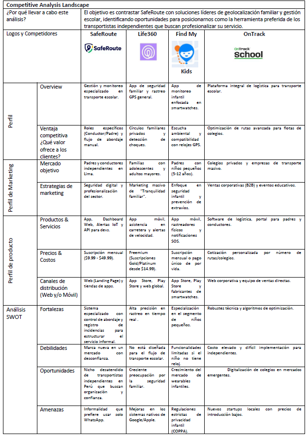
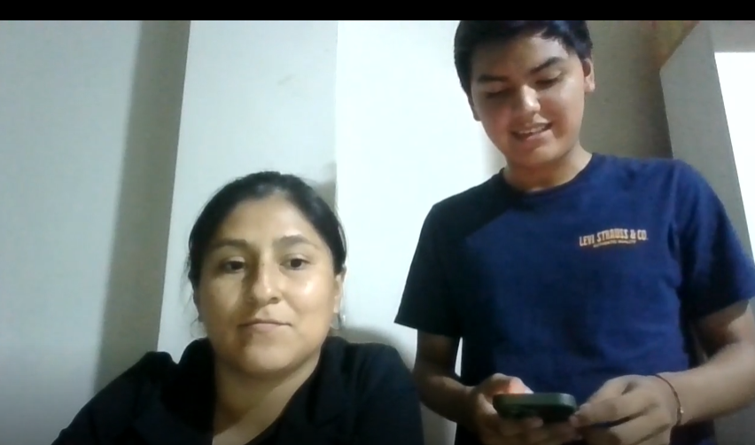
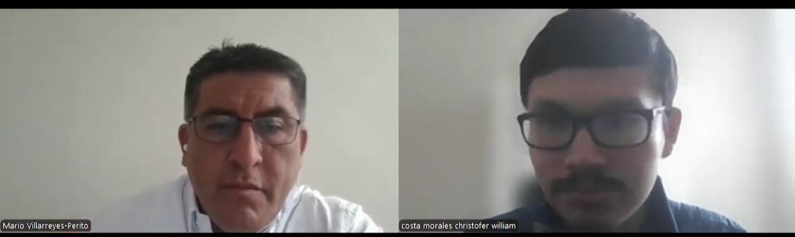
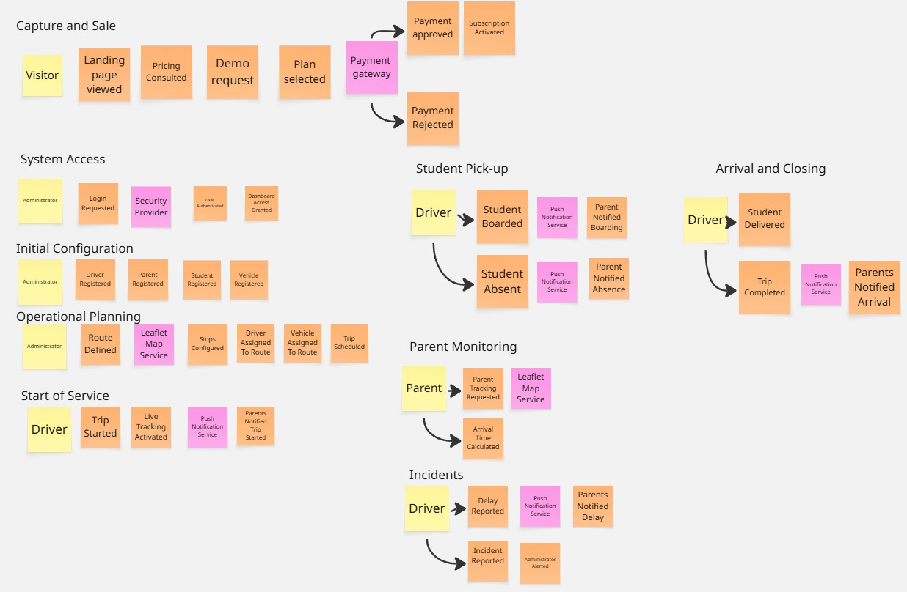

**Nombre de la Universidad:** Universidad Peruana de Ciencias Aplicadas
**Facultad:** Ingeniería  
**Carrera:** Ingeniería de Software
**Ciclo:** 2026-10  

**Código del curso:** 1ASI0730  
**Nombre del curso:** Aplicaciones Web 
**NRC:** 12053  
**Nombre del profesor:** Efraín Ricardo Bautista Ubillús  

**"Informe de Trabajo Final"** 
**Nombre del startup:** PowerTech  
**Nombre del producto:** SafeDrive  

**Relación de integrantes:**

* U202424059 - De La Cruz De Los Santos, Mathias Marcelo
* U202316852 - Ortega Quintana, Jose Zacarias
* U20241D922 - Quispe Serrano, Julio Frank
* U202415551 - Ramirez Ruiz, Nickolas
* U20211D989 - Vallejo Trujillo, Fabio Cesar

##### Abril, 2026

---

## Registro de Versiones del Informe

| Avance | Fecha | Autor | Descripción de Modificación |
| :--- | :--- | :--- | :--- |
| AV1 | --/04/2026 | "-" | "-" |

---

## Project Report Collaboration Insights

El equipo ha utilizado un flujo de trabajo en github: [safedrive-report](https://github.com/FiveTech-NRC11896/safedrive-report)

---

## Contenido

1. [Student Outcome](#student-outcome)
2. [Capítulo I: Introducción](#capítulo-i-introducción)
3. [Capítulo II: Requirements Elicitation & Analysis](#capítulo-ii-requirements-elicitation--analysis)
4. [Capítulo III: Requirements Specification](#capítulo-iii-requirements-specification)
5. [Capítulo IV: Product Design](#capítulo-iv-product-design)
6. [Capítulo V: Product Implementation, Validation & Deployment](#capítulo-v-product-implementation-validation--deployment)
7. [Conclusiones](#conclusiones)
8. [Bibliografía](#bibliografía)

---

## Student Outcome

**ABET - EAC - Student Outcome 5:** Capacidad de funcionar efectivamente en un equipo.

---

## Capítulo I: Introducción

### 1.1. Startup Profile

#### 1.1.1. Descripción de la Startup

FiveTech es una startup de tecnología conformada por estudiantes de Ingeniería de Software de la Universidad Peruana de Ciencias Aplicadas (UPC), orientada al desarrollo de soluciones digitales que resuelven problemas reales en sectores con baja penetración tecnológica. Nació con la convicción de que la seguridad de los niños durante su traslado escolar no debería depender de llamadas telefónicas, mensajes de WhatsApp o registros manuales en papel.
Nuestra propuesta de valor se materializa en SafeRoute, una plataforma web de movilidad institucional inteligente diseñada para digitalizar y optimizar la gestión del transporte escolar. SafeRoute permite a cualquier organización de transporte escolar ya sea un grupo de padres que se organizaron para compartir una movilidad, un conductor independiente o una pequeña empresa del rubro que busquen centralizar la administración de sus rutas, conductores, alumnos y la comunicación en un solo lugar.

#### 1.1.2. Perfiles de integrantes del equipo

|                Foto                | Apellidos y Nombres         |    Código     | Carrera                | Resumen                                                                                                                                                                                                                                                                                                                                                                                                                                                |
| :--------------------------------: | :-------------------------- | :-----------: | :--------------------- | :----------------------------------------------------------------------------------------------------------------------------------------------------------------------------------------------------------------------------------------------------------------------------------------------------------------------------------------------------------------------------------------------------------------------------------------------------- |
|              ![foto]               | [Apellido 1], [Nombre 1]    | [U20XXXXXXXX] | Ingeniería de Software | [Descripción de conocimientos técnicos y habilidades que aporta al equipo]                                                                                                                                                                                                                                                                                                                                                                             |
|              ![foto]               | [Apellido 2], [Nombre 2]    | [U20XXXXXXXX] | Ingeniería de Software | [Descripción de conocimientos técnicos y habilidades que aporta al equipo]                                                                                                                                                                                                                                                                                                                                                                             |
|  | Quispe Serrano, Julio Frank | [U20241D922]  | Ingeniería de Software | Mi nombre es Julio Frank Quispe Serrano, tengo 20 años,actualmente estoy cursando el 5to ciclo de la carrera de Ingeniería de Software en la Universidad Peruana de Ciencias Aplicadas. Soy un apasionado por la programación, el gym y explorador de música en distintos géneros. Mi aporte en este grupo será el de brindar soluciones prácticas y eficientes ante situaciones de adversidad que estanquen la fluidez de la elaboración del trabajo. |
|              ![foto]               | Ortega Quintana, José Zacarias    | [U202316852] | Ingeniería de Software | [Descripción de conocimientos técnicos y habilidades que aporta al equipo]                                                                                                                                                                                                                                                                                                                                                                             |
|              ![foto]               | [Apellido 5], [Nombre 5]    | [U20XXXXXXXX] | Ingeniería de Software | [Descripción de conocimientos técnicos y habilidades que aporta al equipo]                                                                                                                                                                                                                                                                                                                                                                             |

### 1.2. Solution Profile

#### 1.2.1 Antecedentes y problemática

Who (¿Quiénes son los afectados?)
Los afectados son dos grupos claramente identificables. En primer lugar, los padres de familia con hijos en nivel inicial, kínder y primaria que utilizan servicios de transporte escolar privado, quienes no cuentan con información en tiempo real sobre el estado del traslado de sus hijos. En segundo lugar, los conductores de transporte escolar independientes o pertenecientes a pequeñas empresas que gestionan múltiples alumnos y rutas sin herramientas digitales de apoyo.

What (¿Cuál es el problema?)
El transporte escolar privado en el Perú opera en su gran mayoría de forma tradicional y sin soporte tecnológico. La comunicación entre padres y conductores depende de canales no estructurados como llamadas telefónicas y grupos de WhatsApp, lo que genera desorganización, pérdida de información y una sensación constante de incertidumbre en los padres respecto a la seguridad de sus hijos. Por su parte, los conductores y administradores del servicio carecen de herramientas para registrar asistencia, gestionar rutas, reportar incidencias y llevar un historial ordenado de cada trayecto.

Where (¿Dónde ocurre?)
El problema se presenta principalmente en zonas urbanas de Lima Metropolitana, donde la demanda de transporte escolar privado es alta y la oferta opera de manera fragmentada e incluso a veces informal. Sin embargo, la problemática es extensible a cualquier ciudad del Perú con alta densidad de centros educativos privados y colegios que no cuentan con flota propia.

When (¿Cuándo ocurre?)
El problema se manifiesta de forma recurrente durante los horarios de entrada y salida escolar, típicamente entre las 6:00 a.m. y 8:30 a.m., y entre las 12:30 p.m. y 5:00 p.m. Es en estos momentos cuando la falta de información en tiempo real genera mayor ansiedad en los padres y mayor presión operativa en los conductores.

Why (¿Por qué es un problema?)
La ausencia de digitalización en este sector genera consecuencias concretas, por ejemplo los padres no saben si su hijo abordó la movilidad, si llegó al colegio o si ocurrió algún incidente en el camino. Los conductores cometen errores en las paradas, olvidan recoger alumnos o no tienen cómo comunicar retrasos de forma ordenada. Los administradores del servicio pierden tiempo valioso coordinando manualmente lo que podría automatizarse, y no cuentan con registros históricos que les permitan mejorar la operación.

How (¿Cómo se manifiesta?)
Se manifiesta en llamadas y mensajes constantes de padres al conductor durante el trayecto, listas de alumnos escritas en papel o en hojas de cálculo no compartidas, ausencia de registros de incidencias, imposibilidad de verificar el cumplimiento de las paradas, y falta de trazabilidad sobre qué alumnos abordaron o no en cada viaje.

How much (¿Cuál es la magnitud?)
Si bien no existen datos precisos y actualizados que cuantifiquen de forma específica el mercado del transporte escolar privado en el Perú, los indicadores educativos y de transporte disponibles permiten dimensionar la magnitud del problema.
Según el Censo Educativo 2022-2023 del Ministerio de Educación (MINEDU, 2023), en Lima Metropolitana existen aproximadamente 1.9 millones de estudiantes distribuidos en cerca de 7,602 instituciones educativas, de las cuales el 74% son de gestión privada. Esta alta concentración de colegios privados implica que muchas familias dependen de servicios externos de transporte escolar, dado que pocas instituciones cuentan con flotas propias.
Este panorama se ve agravado por una reducción en la oferta formal del servicio. Según la Autoridad de Transporte Urbano para Lima y Callao (ATU, 2024), la cantidad de movilidades escolares autorizadas disminuyó en un 25% en solo un año, lo que sugiere un incremento en la informalidad del sector y, con ello, una mayor ausencia de herramientas de control y monitoreo sobre el servicio que reciben los menores.
Respecto a la seguridad, la Superintendencia de Transporte Terrestre de Personas, Carga y Mercancías (SUTRAN, 2024) ejecutó campañas de sensibilización que alcanzaron a más de 47,000 escolares, evidenciando que la seguridad en el transporte escolar continúa siendo una preocupación activa para las autoridades. Sin embargo, no se dispone públicamente de cifras desagregadas de incidentes específicos en este sector entre 2022 y 2025.

**Figura 1** Distribución de estudiantes de Educación Inicial y Primaria en instituciones privadas y zonas urbanas en el Perú

*Nota.* Adaptado de Resultados del Censo Educativo 2022 (p. 12), por Ministerio de Educación, 2023.

#### 1.2.2 Lean UX Process

##### 1.2.2.1. Lean UX Problem Statements

El transporte escolar privado en el Perú opera mayoritariamente de forma informal, coordinándose mediante llamadas telefónicas, mensajes de WhatsApp y registros manuales en hojas privadas. En este contexto, tanto los padres de familia como los transportistas escolares enfrentan dificultades que comprometen la seguridad y eficiencia del servicio.
Hemos observado un factor crítico que afecta a este ecosistema, los padres de familia no cuentan con visibilidad sobre el trayecto de sus hijos, mientras que los transportistas carecen de herramientas digitales para gestionar rutas, alumnos e incidencias de forma estructurada. Estas dos necesidades son interdependientes, mientras que por un lado los padres necesitan visibilidad, y por el otro los transportistas no tienen los medios para proporcionársela.
¿Cómo podemos desarrollar una plataforma que permita a los transportistas escolares gestionar su operación de forma digital, mientras ofrece simultáneamente a los padres de familia la visibilidad y tranquilidad que necesitan sobre el traslado de sus hijos?

##### 1.2.2.2. Lean UX Assumptions

**Business Assumptions**
- Creemos que existe demanda suficiente para digitalizar el transporte escolar privado en Lima Metropolitana, dado que opera mayoritariamente de forma tradicional y sin soporte tecnológico.
- Creemos que los padres de familia adoptarán la plataforma si el proceso de incorporación es simple y la información que reciben sobre el trayecto de sus hijos es clara y confiable.
- Creemos que los transportistas adoptarán la plataforma si la interfaz operativa durante el trayecto es simple, rápida y no distrae la conducción.
- Creemos que el modelo de suscripción por planes escalonados Básico, Intermedio y Completo permite capturar tanto a grupos pequeños de padres organizados como a empresas de transporte escolar con flotas más grandes.
- Creemos que SafeRoute transmite ahorro de tiempo, reduccion de errores y confianza al transporte de los escolares frente a los padres de familia, lo que justifica el costo de la suscripción.
- Sabremos que estamos equivocados si los administradores abandonan la plataforma en los primeros 60 días por considerar que la curva de aprendizaje es demasiado alta o que el valor percibido no justifica el costo.

**User Assumptions**
- ¿Quién es el usuario? 
Los padres de familia con hijos en nivel inicial, kínder y primaria que utilizan un servicio de transporte escolar ya contratado, y los transportistas escolares  como por ejemplo los conductores independientes o responsables de pequeñas empresas que operan ese servicio. Dentro de la plataforma, cualquiera de estos segmentos puede asumir además el rol de Administrador.
- ¿Dónde encaja nuestro producto en su vida? 
Para el transportista, en su jornada laboral operativa diaria. Para el padre, en los momentos de entrada y salida escolar de sus hijos.
- ¿Qué problemas resuelve? 
Elimina la gestión manual y la comunicación no estructurada del transporte escolar, proporcionando al transportista herramientas operativas digitales y al padre visibilidad del trayecto de sus hijos.
- ¿Cuándo y cómo es usado? 
El transportista lo usa durante cada trayecto para gestionar abordajes, paradas e incidencias. El padre lo consulta en los horarios de traslado escolar para monitorear el estado del viaje de sus hijos.
- ¿Qué características son importantes? 
Registro de abordaje por alumno, visualización de ruta y paradas, reporte de incidencias, historial de trayectos y gestión centralizada de usuarios y rutas.
- ¿Cómo debe verse y comportarse? 
Interfaz limpia, responsiva, rápida y accesible (a11y), disponible en español e inglés (i18n), e intuitiva para usuarios con distintos niveles de familiaridad tecnológica.

##### 1.2.2.3. Lean UX Hypothesis Statements

- Hipótesis 1: "Creemos que lograremos que los padres de familia reduzcan su incertidumbre durante el traslado escolar si ofrecemos a los padres registrados en SafeRoute una vista del estado del trayecto con marcación de abordaje por alumno y visualización de paradas.
Sabremos que esto es verdad cuando veamos que al menos el 70% de los padres activos consulten el estado del trayecto al menos una vez por día durante las primeras 4 semanas de uso."

- Hipótesis 2: "Creemos que lograremos que los transportistas gestionen el trayecto con menos errores y menor carga operativa si ofrecemos a los conductores registrados en SafeRoute una interfaz operativa simple para marcar abordajes, seguir paradas y reportar incidencias durante el viaje.
Sabremos que esto es verdad cuando veamos que el 80% de los trayectos registrados incluyan el check-list de abordaje completado durante las primeras 4 semanas de operación."

- Hipótesis 3: "Creemos que lograremos que los administradores centralicen la gestión de su servicio en SafeRoute si ofrecemos a los administradores del plan Básico un panel único para registrar usuarios, conductores, hijos, asignaciones y rutas. Sabremos que esto es verdad cuando veamos que al menos el 75% de los administradores registren la totalidad de sus usuarios y rutas dentro de los primeros 15 días tras el onboarding."

- Hipótesis 4: "Creemos que lograremos que los administradores escalen su plan de suscripción si demostramos a los administradores de los planes inferiores que las funcionalidades de los plan superiores reducen significativamente el tiempo de coordinación del servicio. Sabremos que esto es verdad cuando veamos que al menos el 20% de los administradores de los planes Básico o Intermedio actualicen al algun plan superior dentro de los primeros 3 meses de uso."

##### 1.2.2.4. Lean UX Canvas

| Sección | Contenido |
| :----- | :--------- |
| 1. Business Problem | El transporte escolar privado en el Perú opera de forma tradicional y sin soporte tecnológico. Los padres no tienen visibilidad sobre el trayecto de sus hijos y los transportistas gestionan su operación con llamadas, WhatsApp y hojas privadas, lo que genera errores, ineficiencia y una experiencia de servicio poco confiable.|
| 2. Business Outcomes| Lograr que el 75% de administradores completen el registro de su operación en los primeros 15 días. Retener al 80% de suscriptores activos durante los primeros 3 meses. Alcanzar una tasa de upgrade del plan Básico al Intermedio del 20% en los primeros 3 meses de uso.|
| 3. Users | Los segmentos que interactúan con SafeRoute son los padres de familia con hijos en nivel inicial, kínder y primaria que utilizan un servicio de transporte escolar ya contratado, y los transportistas escolares conductores independientes o responsables de pequeñas empresas que operan ese servicio. Cualquiera de estos puede asumir además el rol de Administrador dentro de la plataforma.|
| 4. User Outcomes & Benefits | Los padres buscan reducir su incertidumbre sobre el trayecto de sus hijos, pudiendo monitorear el estado del viaje sin necesidad de interrumpir al conductor. Los transportistas buscan gestionar rutas, alumnos e incidencias de forma digital, reduciendo errores operativos y proyectando mayor profesionalismo frente a las familias. Quienes asumen el rol de administrador buscan centralizar toda la operación del servicio en un solo panel, eliminando la coordinación manual y el uso de herramientas desconectadas.|
| 5. Solution Ideas | Ofrecemos un panel de administración de usuarios, conductores, hijos y rutas. Tambien, Check-list de abordaje digital por conductor. Vista de paradas y estado del trayecto para padres. Registro de incidencias por ruta. Historial de trayectos por comunidad de ruta. Seguimiento GPS en tiempo real (plan Completo). Apertura a integración IoT futura.|
| 6. Hypotheses | - Si ofrecemos a los padres una vista de estado del trayecto, al menos el 70% la consultará diariamente en las primeras 4 semanas.  - Si ofrecemos al conductor una interfaz operativa simple, el 80% de los trayectos tendrán el check-list completado en las primeras 4 semanas.  - Si ofrecemos al administrador un panel único de gestión, el 75% completará su registro en los primeros 15 días.  - Si demostramos el valor del plan Intermedio, el 20% de administradores del plan Básico harán upgrade en los primeros 3 meses.|
| 7. What's the most important thing we need to learn first? | ¿El administrador del servicio percibe suficiente valor en SafeRoute como para abandonar los métodos informales actuales y pagar una suscripción mensual?|
| 8. What's the least amount of work we need to do to learn the next most important thing? | Realizar entrevistas con 3 a 5 administradores de servicios de transporte escolar (padres representantes o transportistas independientes) para validar su disposición al cambio y las funcionalidades que consideran imprescindibles antes de desarrollar el MVP.|

### 1.3. Segmentos objetivo

SafeRoute está dirigido a dos segmentos que forman parte del ecosistema del transporte escolar privado en Lima Metropolitana.

- **Segmento 1: Padres de Familia**
El primer segmento está conformado por padres de familia o apoderados con hijos en nivel inicial, kínder y primaria que utilizan un servicio de transporte escolar privado ya contratado. Se trata de personas que han delegado el traslado de sus hijos a un tercero y que, durante el trayecto, no cuentan con información estructurada sobre el estado del viaje. Este segmento no está delimitado por un nivel socioeconómico específico, sino por la condición de tener hijos en edad escolar que usan transporte privado y de contar con acceso a internet desde un dispositivo con navegador web. Su principal motivación al usar SafeRoute es, precisamente, reducir la incertidumbre que genera no saber si sus hijos abordaron con seguridad, en qué parte del recorrido se encuentran o si ocurrió alguna novedad durante el viaje. Para dimensionar este segmento, según el Censo Educativo 2022-2023, en Lima Metropolitana existen aproximadamente 1.9 millones de estudiantes distribuidos en cerca de 7,602 instituciones educativas, de las cuales el 74% son de gestión privada (Ministerio de Educación, 2023). Esta alta proporción de colegios privados implica que una parte significativa de las familias limeñas depende de servicios externos de transporte escolar, dado que pocas instituciones cuentan con flotas propias.

- **Segmento 1: Transportistas Escolares**
El segundo segmento está conformado por las personas o entidades que operan el servicio de transporte escolar privado. Dentro de este segmento conviven tres perfiles distintos. El primero corresponde a personas independientes que ofrecen el servicio de forma autónoma. El segundo agrupa a conductores que han sido asignados para operar una movilidad organizada por un conjunto de familias. El tercero engloba a los responsables de pequeñas empresas de transporte escolar que cuentan con una flota de vehículos y conductores a su cargo. A pesar de sus diferencias, todos comparten un factor común, pues operan sin herramientas digitales especializadas, apoyándose en métodos manuales e informales para gestionar una actividad que involucra directamente la seguridad de menores. La relevancia de este segmento se ve reflejada en que la cantidad de movilidades escolares autorizadas en Lima disminuyó en un 25% en solo un año, lo que evidencia un incremento en la informalidad del sector y, con ello, una mayor ausencia de mecanismos de control y monitoreo sobre el servicio que reciben los menores (Autoridad de Transporte Urbano para Lima y Callao, 2024). Adicionalmente, la Superintendencia de Transporte Terrestre de Personas, Carga y Mercancías ejecutó en 2024 campañas de sensibilización que alcanzaron a más de 47,000 escolares, lo que confirma que la seguridad en este sector continúa siendo una preocupación activa para las autoridades (SUTRAN, 2024). Por ello, la principal motivación de este segmento al usar SafeRoute es digitalizar y profesionalizar su operación, reducir los errores en la gestión de rutas y alumnos, y ofrecer a las familias que atienden una experiencia de servicio más confiable y transparente.

---

## Capítulo II: Requirements Elicitation & Analysis

### 2.1. Competidores

### Identificación de Competidores

En esta sección se describen los principales competidores (directos e indirectos) con modelos de negocio basados en productos digitales similares o servicios complementarios de monitoreo.

#### Life360
**Descripción:** Aplicación de rastreo familiar líder a nivel global que permite compartir la ubicación en tiempo real entre miembros de un grupo, así como recibir alertas de llegada y salida de lugares definidos. Está orientada a mejorar la seguridad y comunicación entre familias mediante funciones de geolocalización avanzada.

* **Enfoque:** Seguridad familiar general.
* **URL:** [https://www.life360.com/](https://www.life360.com/)

#### Find My Kids
**Descripción:** Aplicación de monitoreo parental diseñada para que los padres conozcan la ubicación en tiempo real de sus hijos mediante GPS. Permite revisar el historial de movimientos, escuchar el entorno en caso de emergencia y recibir alertas. Se destaca por su integración con relojes inteligentes (smartwatches) para niños.

* **Enfoque:** Monitoreo infantil y seguridad parental.
* **URL:** [https://findmykids.org/](https://findmykids.org/)

#### OnTrack School
**Descripción:** Sistema digital integral enfocado específicamente en la gestión y monitoreo del transporte escolar. Permite el seguimiento de vehículos en tiempo real, envío de notificaciones automáticas a los padres y control administrativo de rutas y conductores. Está orientado principalmente a instituciones educativas y flotas de transporte escolar.

* **Enfoque:** Gestión logística y transporte escolar corporativo.
* **URL:** [https://ontrack.global/school/](https://ontrack.global/school/)

---

### 2.1.1 Análisis Competitivo - Landscape

**¿Por qué llevar a cabo este análisis?**
El objetivo es contrastar SafeRoute con soluciones líderes de geolocalización familiar y gestión escolar, identificando oportunidades para posicionarnos como la herramienta preferida de los transportistas independientes en Lima que buscan profesionalizar su servicio.
| Categoría | Detalle | **SafeRoute** | **Life360** | **Find My Kids** | **OnTrack School** |
| :--- | :--- | :--- | :--- | :--- | :--- |
| **Perfil** | **Overview** | Gestión y monitoreo especializado en transporte escolar. | App de seguridad familiar y rastreo GPS general. | App de monitoreo infantil enfocada en smartwatches. | Plataforma integral de logística para transporte escolar. |
| **Perfil** | **Ventaja competitiva** | Roles específicos (Conductor/Padre) y flujo de abordaje manual. | Círculos familiares privados y detección de choques. | Escucha ambiental y compatibilidad con relojes GPS. | Optimización de rutas avanzada para flotas de colegios. |
| **Marketing** | **Mercado objetivo** | Padres y conductores independientes en Lima. | Familias con adolescentes y adultos mayores. | Padres con niños pequeños (5-12 años). | Colegios privados y empresas de transporte masivo. |
| **Marketing** | **Estrategias** | Seguridad digital y profesionalización del sector. | Marketing masivo de "Tranquilidad familiar". | Enfoque en seguridad infantil y prevención de extravíos. | Ventas corporativas (B2B) y eventos educativos. |
| **Producto** | **Productos & Servicios** | App, Dashboard Web, Alertas IoT y API para devs. | App móvil, asistencia en carretera y alertas de velocidad. | App móvil, rastreadores físicos y notificaciones SOS. | Software de logística, portal para padres y conductores. |
| **Producto** | **Precios & Costos** | Suscripción mensual ($9.99 - $49.99). | Freemium (Suscripciones Gold/Platinum desde $14.99). | Suscripción mensual o pago único de por vida. | Cotización personalizada por número de rutas/colegios. |
| **Producto** | **Canales de distribución**| Web (Landing Page) y tiendas de apps. | App Store, Play Store y web global. | App Store, Play Store y fabricantes de smartwatches. | Web corporativa y equipo de ventas directas. |
| **SWOT** | **Fortalezas** | Sistema especializado con control de abordaje y registro de incidencias para estructurar el servicio informal. | Alta precisión en rastreo en tiempo real . | Especialización en el segmento de niños pequeños. | Robustez técnica y algoritmos de optimización. |
| **SWOT** | **Debilidades** | Marca nueva en un mercado con desconfianza. | No está diseñada para el flujo de transporte escolar. | Funcionalidades limitadas si el niño no tiene reloj. | Costo elevado y difícil implementación para independientes. |
| **SWOT** | **Oportunidades** | Nicho desatendido de transportistas independientes en Perú que buscan organización y confianza. | Creciente preocupación por la seguridad familiar | Crecimiento del mercado de wearables infantiles. | Digitalización de colegios en mercados emergentes. |
| **SWOT** | **Amenazas** | Informalidad que prefiere usar solo WhatsApp. | Mejoras en los sistemas nativos de Google/Apple. | Regulaciones estrictas de privacidad infantil (COPPA). | Nuevas startups locales con precios de introducción bajos. |

---

### 2.1.2 Estrategias y tácticas frente a competidores

En base al análisis competitivo y SWOT realizado, SafeRoute plantea las siguientes estrategias y tácticas para diferenciarse aprovechando las debilidades de la competencia y el contexto local:

#### Enfoque en especialización del problema
- SafeRoute se posicionará como una solución especializada en transporte escolar, integrando funcionalidades específicas como control de abordaje, gestión de rutas y registro de incidencias.
- Esto permitirá cubrir necesidades logísticas que las soluciones genéricas de GPS ignoran.

#### Estrategia de digitalización del sector no estructurado
- Enfoque en transportistas independientes que actualmente dependen de WhatsApp y procesos manuales.
- Oferta de una plataforma simple e intuitiva para una transición digital sin fricciones técnicas.

#### Diferenciación por simplicidad y accesibilidad
- Priorización de facilidad de uso y costos accesibles frente a soluciones corporativas complejas como OnTrack School.
- Experiencia de usuario optimizada para minimizar la carga operativa del conductor durante el trayecto.

#### Estrategia de confianza y seguridad para padres
- Reducción de la incertidumbre mediante notificaciones automáticas de abordaje y alertas en tiempo real.
- Reemplazo de la comunicación informal por una estructura de datos confiable y profesional.

#### Estrategia de crecimiento progresivo (escalabilidad)
- Modelo de planes escalables (Básico, Intermedio, Completo) que acompaña el crecimiento de la flota del cliente.
- Facilita la adopción inicial con un ticket de entrada bajo.

#### Estrategia de posicionamiento local
- Adaptación a las dinámicas operativas y geográficas de Lima Metropolitana antes de escalar a otras ciudades del Perú.

#### Estrategia de preparación tecnológica futura
- Arquitectura preparada para la integración de sensores y cámaras IoT en etapas posteriores, garantizando competitividad a largo plazo.

### 2.2. Entrevistas

#### 2.2.1. Diseño de entrevistas

##### Guion de Entrevistas - Proyecto SafeRoute

###### **Segmento Objetivo 1: Conductor**

1. ¿Cuál es tu nombre?
2. ¿Cuál es tu edad?
3. ¿Podrías contarme un poco sobre tu entorno familiar? Por ejemplo, si vives con una familia o tienes hijos.
4. ¿En qué distrito o zona sueles trabajar?
5. ¿Podrías contarme un poco sobre tu trabajo como conductor de transporte escolar?
6. ¿Trabajas de manera independiente o en coordinación con otro grupo de personas o empresa?
7. En tu día a día, ¿qué herramientas o medios utilizas para organizar tu trabajo?
8. Cuéntame cómo realizas normalmente el proceso de recoger y dejar a los alumnos.
9. Durante el recorrido, ¿cómo llevas el control de los alumnos?
10. ¿Qué suele pasar cuando ocurre algún cambio o imprevisto en la ruta?
11. ¿Cómo te comunicas con los padres durante el servicio?
12. ¿Qué partes de tu trabajo sientes que requieren más atención o te generan mayor carga?
13. ¿Qué tan organizado sientes que es tu proceso actual de trabajo?
14. Si pudieras mejorar algún aspecto de tu trabajo diario, ¿cuál sería y por qué?
15. ¿Qué tipo de información te ayudaría a sentir mayor control durante el recorrido?
16. ¿Qué preocupaciones tendrías al usar algún tipo de sistema durante el trayecto?
17. ¿Cómo te gustaría que fuera la comunicación con los padres para que no interfiera con tu conducción?
18. ¿Qué tendría que tener una herramienta así para que realmente la uses?
19. ¿Qué tan dispuesto estarías a usar una herramienta que te ayude a organizar y monitorear tu trabajo? ¿Por qué?

---

###### **Segmento Objetivo 2: Padre de Familia**

1. Para comenzar, ¿podrías indicarme tu nombre?
2. ¿Cuál es tu edad?
3. ¿En qué distrito o zona resides?
4. ¿Podrías contarme un poco sobre tu entorno familiar?
5. ¿Qué edades tienen tus hijos que utilizan transporte escolar?
6. ¿Qué rol cumple el transporte escolar dentro de tu día a día?
7. ¿Qué tan cómodo(a) te sientes utilizando tecnología en tu vida diaria?
8. Cuéntame cómo haces actualmente para saber que tu hijo llegó bien a su destino.
9. ¿Qué es lo que más te preocupa cuando tu hijo está en el transporte escolar?
10. ¿Cómo te comunicas normalmente con el conductor o responsable del transporte?
11. ¿Recuerdas alguna situación en la que hayas sentido preocupación o falta de información? ¿Qué ocurrió?
12. ¿Qué tipo de información sientes que hoy no tienes y te gustaría tener?
13. ¿Qué aspectos del servicio de transporte actual te generan más desconfianza o incomodidad?
14. Si pudieras mejorar alguna parte del servicio de transporte escolar, ¿cuál sería y por qué?
15. ¿Qué opinas de una herramienta que te permita tener mayor visibilidad del transporte escolar de tu hijo?
16. ¿En qué aspectos crees que una solución así podría ayudarte en tu día a día?
17. ¿Qué preocupaciones tendrías al usar una herramienta digital para monitorear este servicio?
18. Para finalizar, ¿qué consideras indispensable para sentirte tranquilo(a) con el transporte de tu hijo?

#### 2.2.2. Registro de entrevistas
### Entrevista 1: Arturo Núñez

| Campo | Detalle |
| :--- | :--- |
| Nombre y Apellidos | Arturo Núñez |
| Edad | 28 años |
| Distrito / Zona de trabajo | San Miguel y Miraflores, Lima |
| Segmento | Conductor de Transporte Escolar |
| Inicio en video | 00:15 |
| Duración | 07:19 |
| URL del video | [[https://youtu.be/V0uneeO5sFQ](https://youtu.be/V0uneeO5sFQ)][[https://1drv.ms/v/c/f647ccc757f760c7/IQAVffXPiVroSJbblZ6_3uoTAetjl1xIO23c6V_l0aviUGg?e=KJhdzW](https://1drv.ms/v/c/f647ccc757f760c7/IQAVffXPiVroSJbblZ6_3uoTAetjl1xIO23c6V_l0aviUGg?e=KJhdzW)] |

#### Screenshot

---

## Resumen Descriptivo de la Entrevista

### Características Objetivas y Entorno

Arturo Núñez es un conductor de transporte escolar independiente de 28 años, con aproximadamente seis años de experiencia en el rubro. Opera principalmente en los distritos de San Miguel y Miraflores, zonas urbanas con alto flujo vehicular. Gestiona su propia unidad móvil y administra directamente la captación de clientes, organización de rutas y comunicación con padres de familia.

Su rutina diaria consiste en recoger estudiantes en sus domicilios, trasladarlos al colegio y retornarlos posteriormente según el turno escolar.

### Herramientas, Tecnología y Canales de Interacción

Actualmente utiliza herramientas informales para operar:

- WhatsApp como canal principal de comunicación con padres
- Libreta física para horarios y direcciones
- Google Maps para navegación y rutas alternas
- Smartphone como dispositivo principal de trabajo

El uso del teléfono móvil es constante durante la jornada. Se evidencia familiaridad con aplicaciones digitales de uso cotidiano.

### Características Subjetivas y Personalidad

Arturo presenta un perfil pragmático, independiente y orientado a resultados. Busca mantener el orden operativo, aunque reconoce limitaciones de su sistema actual. Muestra preocupación por la seguridad vial y estrés cuando debe responder mensajes mientras conduce.

También demuestra apertura al cambio tecnológico siempre que la solución sea sencilla, rápida y útil.

### Pain Points Detectados

- Exceso de mensajes durante la conducción
- Distracción al responder consultas de padres
- Dependencia de memoria personal
- Falta de sistema formal de asistencia
- Cambios de ruta difíciles de comunicar
- Estrés operativo en horas punta

### Oportunidades Identificadas

El entrevistado valora altamente una plataforma que permita:

- Ubicación en tiempo real para padres
- Notificaciones automáticas
- Lista diaria de alumnos asistentes
- Registro rápido de abordaje
- Operación con pocos pasos
- Uso estable con señal limitada

### Validación del Arquetipo
La entrevista confirma que el segmento conductor necesita reducir carga operativa, profesionalizar su servicio y automatizar comunicaciones sin comprometer la seguridad al volante. Esto respalda directamente el User Persona definido para SafeRoute.

---
### Entrevista 2: Carla Peláez

| Campo | Detalle |
| :--- | :--- |
| **Nombre y Apellidos** | Carla Peláez |
| **Edad** | 38 años |
| **Distrito / Zona de residencia** | Santiago de Surco, Lima |
| **Segmento** | Padre de Familia |
| **Inicio en video** | 07:42 |
| **Duración** | 04:80 |
| **URL del video** | [https://youtu.be/V0uneeO5sFQ](https://youtu.be/V0uneeO5sFQ)][[https://1drv.ms/v/c/f647ccc757f760c7/IQAVffXPiVroSJbblZ6_3uoTAetjl1xIO23c6V_l0aviUGg?e=KJhdzW](https://1drv.ms/v/c/f647ccc757f760c7/IQAVffXPiVroSJbblZ6_3uoTAetjl1xIO23c6V_l0aviUGg?e=KJhdzW)] |

#### **Screenshot**

> *Captura de pantalla de la entrevista realizada al segmento Padre de Familia.*

---

#### **Resumen Descriptivo de la Entrevista**

### **Características Objetivas y Entorno**

Carla Peláez es una madre de familia de 38 años residente en el distrito de Santiago de Surco. Vive con su esposo y sus cuatro hijos, de los cuales dos utilizan actualmente servicio de transporte escolar. Representa a familias urbanas con alta responsabilidad logística diaria, donde el traslado escolar cumple un rol clave para compatibilizar horarios familiares, laborales y educativos.

El transporte escolar forma parte importante de su rutina diaria, ya que permite asegurar la asistencia puntual de sus hijos al centro educativo.

### **Perfil Tecnológico y Hábitos Digitales**

La entrevistada demuestra una actitud positiva frente al uso de tecnología y asocia las herramientas digitales con mayor seguridad y tranquilidad. Está acostumbrada a recibir información mediante canales digitales institucionales y mensajería móvil.

Actualmente utiliza:

* Teléfono móvil como principal dispositivo de comunicación  
* WhatsApp para contacto con responsables del transporte  
* Sistema digital del colegio para validar asistencia diaria  

Esto evidencia un perfil digital intermedio, con apertura a nuevas soluciones tecnológicas siempre que sean simples y confiables.

### **Proceso Actual y Canales de Interacción**

Para confirmar que sus hijos llegaron correctamente a destino, Carla depende de dos mecanismos externos:

* Confirmación verbal de la responsable de movilidad escolar  
* Confirmación de asistencia enviada por el colegio mediante su sistema interno  

Cuando existe demora o falta de confirmación, se comunica directamente con el colegio para validar la llegada de sus hijos.

Actualmente la comunicación con el conductor o responsable se realiza principalmente por:

* Llamadas telefónicas  
* WhatsApp  

### **Pain Points (Problemas Detectados)**

Durante la entrevista se identificaron preocupaciones relevantes:

* Angustia cuando la movilidad se retrasa  
* Ansiedad cuando no llega la confirmación del colegio  
* Falta de visibilidad en tiempo real durante el trayecto  
* Dependencia de terceros para validar información  
* Percepción de inseguridad en el contexto actual de transporte urbano  
* Menor confianza cuando la movilidad no pertenece directamente al colegio  

Estos puntos reflejan una necesidad clara de trazabilidad, confianza y comunicación inmediata.

### **Necesidades y Oportunidades Detectadas**

Carla mostró alta aceptación hacia una plataforma digital que le permita:

* Ver la ruta del vehículo en tiempo real  
* Conocer si ocurrió algún inconveniente durante el trayecto  
* Recibir confirmación automática de llegada  
* Saber la ubicación permanente de sus hijos  
* Reducir ansiedad e incertidumbre diaria  
* Incrementar confianza en el servicio contratado  

Para Carla, el atributo más importante para sentirse tranquila es:

“Saber en dónde está en todo momento”.

### **Características Subjetivas y Personalidad**

A partir de sus respuestas, se identifica un perfil:

* Protector y orientado al bienestar familiar  
* Preventivo frente a riesgos externos  
* Receptivo a herramientas digitales útiles  
* Sensible a la falta de información  
* Altamente motivado por la seguridad de sus hijos  

### **Validación del Arquetipo**
Los datos recolectados en esta entrevista validan los supuestos definidos para el segmento Padre de Familia dentro del proyecto SafeRoute. Se confirma que este segmento prioriza:

* Seguridad del estudiante  
* Monitoreo en tiempo real  
* Alertas automáticas  
* Comunicación confiable  
* Reducción de ansiedad durante el traslado escolar  

Asimismo, respalda los objetivos del Impact Mapping relacionados con generar tranquilidad, confianza y visibilidad operacional para las familias usuarias.

---

### Entrevista 3: Marío Villarreyes

| Campo | Detalle |
| :--- | :--- |
| **Nombre y Apellidos** | Marío Villarreyes |
| **Edad** | 49 años |
| **Distrito / Zona de residencia** | Pueblo Libre, Lima |
| **Segmento** | Padre de Familia |
| **Inicio en video** | 00:09 |
| **Duración** | 07:33 |
| **URL del video** | [[Youtube](https://youtu.be/NhtjkSpnv3k?si=tg0VZ5xNxyN6yhRy)][[MicrosoftStream](https://upcedupe-my.sharepoint.com/:v:/g/personal/u202315968_upc_edu_pe/IQCFcKSMHqnMRpxySd5Z7SzwAebsgh4yqTjlfgDpPLZLbx0?nav=eyJyZWZlcnJhbEluZm8iOnsicmVmZXJyYWxBcHAiOiJTdHJlYW1XZWJBcHAiLCJyZWZlcnJhbFZpZXciOiJTaGFyZURpYWxvZy1MaW5rIiwicmVmZXJyYWxBcHBQbGF0Zm9ybSI6IldlYiIsInJlZmVycmFsTW9kZSI6InZpZXcifX0%3D&e=1n8JEB)] |

#### **Screenshot**

#### **Resumen Descriptivo de la Entrevista**

### **Características Objetivas y Entorno**

Marío Villarreyes es una madre de familia de 49 años residente en el distrito de Pueblo Libre. Vive con su esposa y sus dos hijos, los dos utilizan transporte escolar para regresar a su casa. Representa a las familias urbanas con alta responsabilidad logística diaria, donde el traslado escolar cumple un rol clave para mantener una mejor organización de horarios familiares, laborales y educativos.

El transporte escolar forma parte importante de su rutina diaria, ya que permite asegurar la asistencia puntual de sus hijos al centro educativo. Sin que se vea perjudicado en su trabajo.

### **Perfil Tecnológico y Hábitos Digitales**

La entrevistada demuestra una actitud positiva y proactiva frente al uso de tecnología y asocia las herramientas digitales con mayor seguridad,tranquilidad y confianza. Está acostumbrada a recibir información mediante canales digitales, institucionales y mensajería móvil.

Actualmente utiliza:

* Teléfono móvil como principal dispositivo de comunicación  
* Laptop como dispositivo laboral principal y tambien de comunicación secundario
* WhatsApp para contacto con responsables del transporte   

Esto evidencia un perfil digital Avanzado, con apertura a nuevas soluciones tecnológicas siempre que sean comprensibles, confiables y rapidas.

### **Proceso Actual y Canales de Interacción**

Para confirmar que sus hijos llegaron correctamente a destino, Marío depende de dos mecanismos externos:

* Confirmación verbal o escrita de la responsable de la movilidad escolar  
* Confirmación de salida enviada por el colegio mediante su sistema interna  

Cuando existe demora o falta de confirmación, se comunica directamente con el colegio para validar la llegada de sus hijos.

Actualmente la comunicación con el conductor o responsable se realiza principalmente por:

* Llamadas telefónicas  
* WhatsApp  

### **Pain Points (Problemas Detectados)**

Durante la entrevista se identificaron preocupaciones relevantes:

* Ansiedad cuando no llega la confirmación del colegio  
* Falta de visibilidad en tiempo real durante el trayecto  
* Dependencia de terceros para validar información del conductor y vehiculo 
* Percepción de inseguridad en el contexto actual de transporte urbano e inseguridad en la pista 
* Menor confianza cuando la movilidad no pertenece directamente al colegio  

Estos puntos reflejan una necesidad clara de monitoreao, confianza y comunicación inmediata.

### **Necesidades y Oportunidades Detectadas**

Marío mostró alta aceptación hacia una plataforma digital que le permita:

* Ver la ruta del vehículo en tiempo real  
* Conocer si ocurrió algún inconveniente durante el trayecto  
* Saber la información del vehiculo
* Verificar las credenciales del conductor
* Saber la ubicación permanente de sus hijos  
* Reducir ansiedad e incertidumbre diaria  
* Incrementar confianza en el servicio contratado  

Para Marío, el atributo más importante para sentirse tranquila es:

“Qué el transporte tenga todas las seguridades”.

### **Características Subjetivas y Personalidad**

A partir de sus respuestas, se identifica un perfil:

* Protector y orientado al bienestar familiar  
* Preventivo frente a riesgos externos  
* Apoyo a las herramientas digitales   
* Sensible y temeroso ante la falta de información  
* Altamente motivado por la seguridad de sus hijos

### **Validación del Arquetipo**
Los datos recolectados en esta entrevista validan los supuestos definidos para el segmento Padre de Familia dentro del proyecto SafeRoute. Se confirma que este segmento prioriza:

* Seguridad del estudiante  
* Monitoreo en tiempo real  
* Alertas automáticas 
* Comunicación confiable  
* Reducción de ansiedad durante el traslado escolar  

Asimismo, respalda los objetivos del Impact Mapping relacionados con generar tranquilidad, confianza y visibilidad operacional para las familias usuarias.

---

#### 2.2.3. Análisis de entrevistas

## Segmento Objetivo 1: Conductores de Transporte Escolar

El presente análisis corresponde a una muestra inicial de 1 entrevista válida del segmento conductor, por lo que los porcentajes reflejan únicamente los hallazgos preliminares del entrevistado y serán refinados con futuras entrevistas.
### Características Objetivas del Segmento

| Característica | Resultado | Sustento |
|---|---|---|
| Edad joven-adulta (25 a 35 años) | 100% | Arturo tiene 28 años |
| Trabajo independiente | 100% | Indica operar con unidad propia y captar clientes directamente |
| Experiencia en el rubro mayor a 5 años | 100% | Señala 6 años trabajando en transporte escolar |
| Opera en zonas urbanas congestionadas | 100% | Trabaja en San Miguel y Miraflores |
| Manejo de ruta diaria fija | 100% | Realiza recojo, traslado al colegio y retorno |

### Hallazgo

El segmento conductor evaluado corresponde a microoperadores independientes que administran su propio servicio y requieren herramientas de gestión simples, móviles y rápidas.

### Uso de Tecnología y Herramientas Actuales

| Herramienta / Canal | Porcentaje |
|---|---|
| WhatsApp como canal principal con padres | 100% |
| Libreta física para horarios/direcciones | 100% |
| Google Maps para navegación | 100% |
| Uso combinado de herramientas manuales + digitales | 100% |

### Principales Problemas Detectados (Pain Points)

| Problema identificado | Porcentaje |
|---|---|
| Exceso de mensajes durante la conducción | 100% |
| Distracción por responder padres en ruta | 100% |
| Dependencia de memoria personal | 100% |
| Estrés ante tráfico o cambios imprevistos | 100% |
| Falta de visibilidad para padres genera presión | 100% |

### Necesidades Funcionales Prioritarias

| Necesidad mencionada | Porcentaje |
|---|---|
| Ubicación visible para padres sin escribir al conductor | 100% |
| Notificaciones automáticas de abordaje/llegada | 100% |
| Lista digital de alumnos del día | 100% |
| Confirmación previa de asistencia | 100% |
| App sencilla e intuitiva | 100% |
| Funcionamiento con señal limitada | 100% |

### Características Subjetivas del Segmento

| Rasgo detectado | Porcentaje |
|---|---|
| Alta disposición a adoptar tecnología útil | 100% |
| Mentalidad pragmática | 100% |
| Valora eficiencia y orden | 100% |
| Sensible a distracciones durante manejo | 100% |
| Busca profesionalizar su servicio | 100% |

----
## Segmento Objetivo 2: Padres de Familia

El presente análisis corresponde a una muestra inicial de 1 entrevista válida del segmento padres de familia, por lo que los porcentajes reflejan únicamente los hallazgos preliminares de la entrevistada y serán refinados con futuras entrevistas.

### Características Objetivas del Segmento

| Característica | Resultado | Sustento |
|---|---|---|
| Adulto responsable entre 35 y 45 años | 100% | Carla tiene 38 años |
| Reside en zona urbana consolidada | 100% | Vive en Surco, Lima |
| Hogar con hijos en etapa escolar | 100% | Indica tener cuatro hijos |
| Uso recurrente de transporte escolar | 100% | Señala que el servicio es importante para asistir al centro de estudios |
| Necesidad diaria de coordinación familiar | 100% | Gestiona traslado y seguimiento de varios hijos |

### Hallazgo

El segmento evaluado corresponde a padres de familia con alta responsabilidad logística diaria, que valoran la seguridad, la información oportuna y la tranquilidad emocional durante el traslado escolar.

### Uso de Tecnología y Herramientas Actuales

| Herramienta / Canal | Porcentaje |
|---|---|
| WhatsApp / Teléfono para comunicación con movilidad | 100% |
| Sistema del colegio para confirmar asistencia | 100% |
| Uso de smartphone como canal principal | 100% |
| Dependencia de terceros para recibir información | 100% |

### Principales Problemas Detectados (Pain Points)

| Problema identificado | Porcentaje |
|---|---|
| Ansiedad cuando la movilidad demora | 100% |
| Preocupación si no llega confirmación del colegio | 100% |
| Falta de ubicación en tiempo real | 100% |
| Temor a accidentes o incidentes de seguridad | 100% |
| Desconfianza hacia servicios externos no afiliados al colegio | 100% |

### Necesidades Funcionales Prioritarias

| Necesidad mencionada | Porcentaje |
|---|---|
| Ver ubicación en tiempo real del transporte | 100% |
| Confirmación automática de llegada | 100% |
| Alertas ante retrasos o inconvenientes | 100% |
| Mayor visibilidad de la ruta diaria | 100% |
| Herramienta simple desde celular | 100% |
| Sentir tranquilidad y control del proceso | 100% |

### Características Subjetivas del Segmento

| Rasgo detectado | Porcentaje |
|---|---|
| Alta preocupación por seguridad infantil | 100% |
| Alta receptividad hacia soluciones digitales útiles | 100% |
| Busca reducir ansiedad diaria | 100% |
| Valora confianza institucional | 100% |
| Perfil práctico orientado a familia | 100% |

### Conclusión del Segmento

El perfil preliminar evidencia que los padres no buscan solo tecnología, sino tranquilidad. Una solución digital será valorada si reduce incertidumbre, mejora la confianza y entrega información clara sin depender de llamadas o mensajes manuales.

### 2.3. Needfinding

#### 2.3.1. User Personas

En esta sección se presentan los arquetipos de usuario diseñados para representar los segmentos objetivo de SafeRoute: el conductor de transporte escolar independiente y el padre de familia. 

La elaboración de estas fichas es el resultado de una síntesis detallada entre el análisis de la competencia y el proceso de Needfinding. Se han identificado características críticas como la alta dependencia de herramientas informales (WhatsApp/Llamadas), la ansiedad generada por la incertidumbre del tráfico en Lima y la necesidad de profesionalizar un sector mayoritariamente no estructurado.

###### **Segmento Objetivo 1: Conductor **

---
###### **Segmento Objetivo 2: Padre de Familia**

#### 2.3.2. User Task Matrix

En esta sección se presenta la matriz de tareas de usuario , la cual consolida las actividades fundamentales que tanto el conductor (Carlos Ramírez) como el padre de familia (Rosita Nery) ejecutan para asegurar un traslado escolar exitoso. 

Es importante destacar que estas tareas representan necesidades y procesos intrínsecos del servicio que existen independientemente de la existencia de una solución de software; el objetivo de SafeRoute es optimizar y digitalizar estas interacciones para reducir la carga operativa y la incertidumbre.

#### Cuadro: User Task Matrix

| Tarea (User Task) | Conductor - Frecuencia | Conductor - Importancia | Padre - Frecuencia | Padre - Importancia |
|:---|:---:|:---:|:---:|:---:|
| Verificar lista de asistencia de alumnos | Alta | Alta | N/A | N/A |
| Identificar alumnos en el punto de recojo | Alta | Alta | N/A | N/A |
| Confirmar el abordaje seguro del alumno | Alta | Crítica | Alta | Crítica |
| Gestionar comunicación entre conductores y padres | Alta | Alta | Alta | Alta |
| Notificar retrasos o imprevistos en la ruta | Media | Alta | Alta | Crítica |
| Monitorear el progreso del trayecto | Media | Media | Alta | Alta |
| Confirmar llegada al destino final | Alta | Crítica | Alta | Crítica |
| Registrar la entrega del alumno al responsable | Alta | Crítica | Alta | Crítica |
| Coordinar cambios de último momento en el servicio | Baja | Media | Baja | Alta |
| Reportar incidencias de seguridad o salud | Baja | Crítica | Baja | Crítica |
| Consultar el estado actual del servicio | Media | Media | Alta | Alta |
| Revisar historial de trayectos realizados | Baja | Media | Media | Media |
| Organizar y optimizar rutas y paradas | Alta | Alta | N/A | N/A |

---

#### Análisis y Explicación de la Matriz

Tras el análisis de la matriz, se desprenden las siguientes conclusiones clave sobre el comportamiento y necesidades de los segmentos:

* **Coincidencias en Tareas Críticas:** Existe una convergencia total en las tareas de "Confirmar abordaje", "Confirmar llegada" y "Registrar entrega". Para ambos segmentos, estas acciones representan la columna vertebral de la confianza en el servicio, manteniendo una importancia **Crítica** debido a que involucran la seguridad directa del menor.
* **Diferencias de Rol:** La carga operativa de planificación y ejecución (verificación de listas y organización de rutas) recae exclusivamente en el conductor. Por el contrario, el padre de familia se enfoca en tareas de supervisión pasiva como "Monitorear el progreso", que tiene una frecuencia alta debido a la ansiedad constante que genera el tráfico de la ciudad.
* **Gestión de Incidencias:** Se observa que tareas como "Reportar incidencias" tienen una frecuencia baja, pero su importancia es crítica. Esto valida la necesidad de que SafeRoute ofrezca canales de comunicación prioritarios que garanticen que, ante un imprevisto, la información fluya sin errores.
* **Fricción en la Comunicación:** La tarea de "Notificar retrasos" es de frecuencia media para el conductor pero de importancia crítica para el padre, lo que resalta el mayor punto de fricción actual: la necesidad de información en tiempo real para reducir el estrés parental.

#### 2.3.3. User Journey Mapping

En esta sección se presentan los User Journey Maps en versión As-Is correspondientes a los dos segmentos objetivo definidos previamente: conductor escolar y padre de familia. El propósito es comprender la experiencia actual del servicio de transporte escolar, identificando emociones, fricciones operativas, puntos críticos de comunicación y oportunidades de mejora antes de la implementación de SafeRoute.
A continuación, se presentan los diagramas detallados para cada User Persona, vinculando sus objetivos y puntos de dolor con las etapas del proceso actual.

User Journey Map: Carlos Ramírez (Conductor-Segmento Objetivo 1)

----
User Journey Map: Rosita Nery (Padre de Familia-Segmento Objetivo 2)

#### 2.3.4. Empathy Mapping
En esta sección se presenta el análisis de empatía realizado para nuestros segmentos objetivo buscando responder las preguntas ¿Con quién estamos empatizando? ¿Qué necesita hacer? ¿Qué está
diciendo? ¿Qué está viendo? ¿Qué está haciendo? ¿Qué está escuchando? ¿Cómo sesiente y qué piensa? E identificando sus Pains y Gains.

Segmento Objetivo 1: Conductor 

---
Segmento Objetivo 2: Padre de familia 

### 2.4. Big Picture Event Storming
En esta sección, se presenta el desarrollo y los resultados de la sesión de Big Picture Event Storming realizada por el equipo para el proyecto SafeRoute. Este proceso consistió en una sesión colaborativa de modelado dirigida al dominio, donde el equipo se enfocó en comprender el ecosistema del negocio de movilidad escolar de manera integral.

A través de esta dinámica, se logró plasmar los eventos significativos y sus interrelaciones, construyendo una primera aproximación visual de alto nivel que explora el landscape completo del negocio.

* **URL:** [[https://miro.com/app/board/uXjVGhc-MhA=/](https://miro.com/app/board/uXjVGhc-MhA=/)]

### 2.5. Ubiquitous Language
En esta sección se presenta el glosario de términos de negocio utilizados dentro del dominio de SafeRoute. 
| Term (English) | Equivalente en Español | Definición |
|---|---|---|
| Administrator | Administrador | Persona o entidad responsable de la gestión operativa del servicio de movilidad escolar. Administra usuarios, rutas, vehículos, estudiantes y suscripciones. |
| Driver | Conductor | Responsable de operar la unidad de transporte escolar y ejecutar el viaje diario. Registra eventos como inicio de trayecto, abordaje, incidencias y cierre de ruta. |
| Parent | Padre de familia / Tutor | Usuario final que monitorea el recorrido del estudiante, recibe notificaciones y valida la seguridad del servicio. |
| Student | Estudiante / Alumno | Beneficiario del servicio de transporte escolar. Su estado de abordaje, traslado y entrega representa el núcleo operativo del sistema. |
| Visitor | Visitante | Usuario no registrado que accede a la Landing Page para conocer el servicio, consultar precios o solicitar una demostración. |
| Subscription | Suscripción | Acuerdo comercial que habilita el acceso a la plataforma SafeRoute según un plan contratado y vigente. |
| Plan | Plan | Oferta comercial (Basic, Intermediate, Premium) que determina funcionalidades, límites operativos y capacidad de uso del sistema. |
| Billing Cycle | Ciclo de facturación | Periodo de tiempo en el que se cobra y renueva la suscripción del cliente (mensual o anual). |
| Payment | Pago | Transacción económica realizada por el Administrador para activar o renovar una suscripción. |
| Invoice | Factura / Comprobante | Documento emitido luego de un pago exitoso como constancia de la transacción realizada. |
| Route | Ruta | Definición logística que incluye origen, destino, paradas y secuencia del recorrido escolar. |
| Stop | Parada | Punto físico autorizado donde el vehículo recoge o entrega estudiantes. |
| Checkpoint | Punto de control | Referencia geográfica dentro de la ruta utilizada para validar avance y calcular tiempos estimados. |
| Trip | Viaje / Trayecto | Ejecución en tiempo real de una ruta programada en una fecha y horario determinados. |
| Scheduled Trip | Viaje programado | Viaje previamente configurado para una fecha, conductor, vehículo y ruta específica. |
| Boarding | Abordaje | Acción física y registro digital del momento en que el estudiante sube al vehículo. |
| Boarding Status | Estado de abordaje | Estado operativo del estudiante durante el viaje (Boarded, Absent, Delivered, Pending). |
| Absence | Ausencia | Evento registrado cuando el estudiante no aborda la unidad en la parada correspondiente. |
| Delivery | Entrega | Confirmación de que el estudiante fue dejado de forma segura en destino autorizado. |
| Vehicle | Vehículo / Unidad | Medio de transporte asignado a rutas específicas dentro de la operación escolar. |
| Fleet | Flota | Conjunto de vehículos administrados por una misma organización o administrador. |
| Driver Assignment | Asignación de conductor | Acción mediante la cual un conductor queda vinculado a una ruta o viaje programado. |
| Vehicle Assignment | Asignación de vehículo | Acción mediante la cual una unidad queda vinculada a una ruta o viaje programado. |
| Manifest | Manifiesto | Lista oficial de estudiantes asignados a una ruta o grupo para control operativo y asistencia. |
| Group | Grupo | Conjunto de estudiantes relacionados a una ruta, zona o servicio común. |
| Live Tracking | Monitoreo en tiempo real | Visualización dinámica de la ubicación actual del vehículo durante el viaje. |
| ETA (Estimated Time of Arrival) | Tiempo estimado de llegada | Predicción del tiempo restante para llegar a una parada o destino. |
| Incident | Incidente | Evento no planificado reportado durante el trayecto, como retrasos, tráfico, avería o emergencia. |
| Delay | Retraso | Desviación del horario esperado del viaje respecto a la planificación original. |
| Emergency Alert | Alerta de emergencia | Notificación prioritaria generada ante una situación crítica que requiere atención inmediata. |
| Notification | Notificación | Comunicación automática enviada al usuario sobre eventos relevantes del servicio. |
| Push Notification | Notificación push | Mensaje inmediato enviado al dispositivo móvil del usuario. |
| Announcement | Comunicado | Mensaje masivo emitido por la administración hacia padres o usuarios registrados. |
| Dashboard | Panel de control | Vista de gestión donde el Administrador monitorea operaciones, métricas y configuraciones. |
| Attendance | Asistencia | Registro histórico de abordajes y ausencias del estudiante. |
| Attendance Report | Reporte de asistencia | Resumen periódico del historial de presencia de estudiantes en el servicio. |
| Trip History | Historial de viajes | Registro consolidado de trayectos ejecutados anteriormente. |
| Security Validation | Validación de seguridad | Confirmación de identidad o permisos para acceder a funciones sensibles del servicio. |
| Account Provisioning | Habilitación de cuenta | Proceso de creación y activación de acceso para un usuario del sistema. |
| Role | Rol | Perfil funcional del usuario dentro del negocio (Administrator, Driver, Parent). |
| Capacity Limit | Límite de capacidad | Restricción operativa determinada por el plan contratado, como número de rutas o conductores permitidos. |
| Renewal | Renovación | Extensión de una suscripción al completar un nuevo pago. |
| Suspension | Suspensión | Estado en el que se restringe el acceso al sistema por falta de pago o incumplimiento. |
| Landing Page | Página informativa principal | Sitio web orientado a captación comercial donde se presenta la propuesta de valor del servicio. |
| Demo Request | Solicitud de demostración | Petición comercial realizada por un visitante interesado en conocer el producto. |
| Pricing | Precios / Tarifario | Información pública de costos y beneficios asociados a cada plan disponible. |
| Trust Signal | Señal de confianza | Elemento comercial que incrementa credibilidad, como testimonios, alianzas o certificaciones. |

---

## Capítulo III: Requirements Specification

### 3.1. User Stories

### 3.2. Impact Mapping

### 3.3. Product Backlog

---

## Capítulo IV: Product Design

### 4.1. Style Guidelines

#### 4.1.1. General Style Guidelines

#### 4.1.2. Web Style Guidelines

### 4.2. Information Architecture

#### 4.2.1. Organization Systems

#### 4.2.2. Labeling Systems

#### 4.2.3. SEO Tags and Meta Tags

#### 4.2.4. Searching Systems

#### 4.2.5. Navigation Systems

### 4.3. Landing Page UI Design

#### 4.3.1. Landing Page Wireframe

#### 4.3.2. Landing Page Mock-up

### 4.4. Web Applications UX/UI Design

#### 4.4.1. Web Applications Wireframes

#### 4.4.2. Web Applications Wireflow Diagrams

#### 4.4.2. Web Applications Mock-ups

#### 4.4.3. Web Applications User Flow Diagrams

### 4.5. Web Applications Prototyping

### 4.6. Domain-Driven Software Architecture

#### 4.6.1. Design-Level Event Storming

#### 4.6.2. Software Architecture Context Diagram

#### 4.6.3. Software Architecture Container Diagrams

#### 4.6.4. Software Architecture Components Diagrams

### 4.7. Software Object-Oriented Design

#### 4.7.1. Class Diagrams

### 4.8. Database Design

#### 4.8.1. Database Diagrams

---

## Capítulo V: Product Implementation, Validation & Deployment

### 5.1. Software Configuration Management

#### 5.1.1. Software Development Environment Configuration

En esta sección se describen las herramientas y tecnologías utilizadas para el desarrollo del proyecto.

##### UX/UI Design

* **Figma**  
  Herramienta de diseño colaborativo utilizada para la creación de wireframes, mockups, prototipos y diseño de interfaces de usuario. Permite trabajar en equipo en tiempo real, facilitando la validación temprana de la experiencia del usuario.

---

##### Software Development

* **JetBrains Rider**  
  Entorno de desarrollo integrado (IDE) utilizado para el desarrollo del backend en C#.

* **Visual Studio Code**  
  Editor de código ligero utilizado como herramienta complementaria para el desarrollo frontend y edición de archivos del proyecto.

* **GitHub**  
  Plataforma de control de versiones utilizada para la gestión del código fuente y colaboración del equipo, implementando la metodología GitFlow para la organización del desarrollo.

* **HTML**  
  Lenguaje de marcado utilizado para la estructura de las interfaces web.

* **CSS**  
  Lenguaje de estilos utilizado para la presentación visual de la aplicación.

* **JavaScript (Vue.js)**  
  Framework utilizado para el desarrollo del frontend, permitiendo la creación de interfaces dinámicas e interactivas.

* **C#**  
  Lenguaje de programación utilizado para el desarrollo del backend de la aplicación.

---

### Software Deployment

* **GitHub Pages**  
  Servicio utilizado para el despliegue de la landing page del proyecto.

* **Vercel**  
  Plataforma utilizada para el despliegue del frontend desarrollado en Vue.js, permitiendo una integración continua y despliegue automatizado.

* **Railway**  
  Plataforma utilizada para el despliegue de servicios backend y APIs, facilitando la conexión entre frontend y backend en un entorno accesible en la nube.

#### 5.1.2. Source Code Management

Para el manejo del código fuente, utilizamos GitHub para colaborar entre miembros de equipo en multiples repositorios. A continuación se listan los enlaces de cada repositorio utilizado.

* Organización: <https://github.com/PowerTech-NRC12053>
* Repositorio de Landing Page: <https://github.com/PowerTech-NRC12053/safedrive-landing-page>
* Repositorio del informe: <https://github.com/PowerTech-NRC12053/safedrive-report>
* Repositorio del frontend: <https://github.com/PowerTech-NRC12053/safedrive-frontend-applications>
* Repositorio del backend: <https://github.com/PowerTech-NRC12053/safedrive-web-services>

En el repositorio del informe se seguirá un esquema de trabajo basado en GitFlow. La rama main almacenará la versión estable del informe correspondiente a cada entregable del trabajo, mientras que la rama develop concentrará la integración de avances validados por cada integrante antes de su consolidación final. A partir de develop, cada integrante creará ramas feature de trabajo para las secciones asignadas. Las ramas feature seguirán una nomenclatura asociada al capítulo o bloque trabajado, por ejemplo: feature/chapter-1-introduction-and-lean-ux, o feature/chapter-5-software-configuration-management. Esta convención permite identificar con claridad qué parte del informe está siendo desarrollada y reduce el riesgo de conflictos entre los miembros del equipo.

En los repositorios del Landing Page, Frontend y Backend también se utilizará GitFlow. En cada uno de ellos, la rama main contendrá las versiones estables del producto y la rama develop servirá como rama de integración del trabajo colaborativo. A partir de develop, se crearán ramas feature/... para el desarrollo de funcionalidades específicas. A diferencia del informe, en estos repositorios las ramas no estarán organizadas por capítulos, sino por funcionalidades o componentes del sistema. Algunos ejemplos de nomenclatura son: feature/home-page, feature/dashboard o feature/route-management. Esta convención nos permite que las ramas reflejen de manera directa el alcance funcional del producto en desarrollo.

No se realizarán cambios directos sobre la rama main, ya que esta representará únicamente versiones estables y listas para consolidarse como parte de un entregable. Del mismo modo, se evitará que los integrantes trabajen de forma continua directamente sobre la rama develop, ya que el flujo previsto consiste en desarrollar primero en ramas feature, integrar luego en develop y finalmente consolidar en main cuando el avance haya sido revisado y validado. Por tanto, el flujo general de trabajo será de la siguiente forma: feature → develop → main. Este esquema se alinea con la exigencia del curso de explicar la implementación de GitFlow mediante ramas principales, ramas de features, y convenciones para releases y hotfixes.

Asimismo, si se requiere corregir errores críticos sobre una versión estable, se podrán crear ramas hotfix/..., y si se decide preparar una versión de cierre antes de una entrega, se utilizarán ramas release/... de acuerdo con el flujo definido por GitFlow.

En relación con los mensajes de cada commit, el equipo aplicará Conventional Commits para mantener un historial más legible, consistente y profesional. Esta convención facilitará la revisión de avances y permitirá identificar rápidamente el propósito de cada uno de los cambios. Algunos prefijos que se utilizarán son:

* feat: incorporación de una nueva funcionalidad
* fix: corrección de errores
* docs: cambios en documentación
* style: cambios de formato o estilo sin alterar lógica
* refactor: reorganización interna sin agregar funcionalidad nueva
* test: incorporación o ajuste de pruebas
* chore: tareas de mantenimiento o configuración

Para el repositorio del informe se emplearán mensajes como docs(report): add project cover page o docs: add startup profile and lean ux process for chapter 1. Para los repositorios de software se utilizarán mensajes como feat: add school route registration, feat: implement student assignment to route o fix: correct login validation. Esta práctica contribuye a que la evidencia de commits sea coherente con el trabajo realizado por cada miembro

#### 5.1.3. Source Code Style Guide & Conventions

En esta sección se definen las convenciones de nombres y codificación adoptadas por el equipo para los lenguajes utilizados en el proyecto: HTML, CSS, JavaScript (Vue.js) y C#.

### Principios generales

* **Idioma estándar:** Todo el código fuente se desarrolla en inglés, incluyendo nombres de variables, funciones, clases, archivos y la documentación del código.
* **Legibilidad:** Se prioriza el uso de nombres descriptivos y claros, evitando abreviaciones innecesarias.
* **Consistencia:** Se mantiene un estilo uniforme en todo el proyecto para facilitar el trabajo colaborativo.
* **Nombres semánticos:**  
  * Sustantivos para clases y componentes.  
  * Verbos para funciones y métodos.
  
---

### HTML

* Los archivos terminan en `.html`.
* Se utilizan etiquetas semánticas como:
  * `<header>`, `<nav>`, `<section>`, `<article>`, `<footer>`.
* Se emplean atributos descriptivos para mejorar la accesibilidad (`alt`, `aria-*`).
* Estructura clara y ordenada para facilitar mantenimiento.

---

### CSS

* Los archivos terminan en `.css`.
* Las clases se nombran en **kebab-case**:
  * `.main-header`, `.route-card`, `.student-list`.
* Se mantiene consistencia visual mediante estilos reutilizables.

---

### JavaScript (Vue.js)

* Los archivos terminan en `.js`.
* Se utiliza **camelCase** para variables y funciones:
  * `getRoutes`, `calculateDistance`.
* Se prioriza el uso de `const` y `let`, evitando `var`.
* Los componentes de Vue siguen una estructura modular y reutilizable.
* Se mantiene separación clara entre lógica, presentación y datos.
* Se utilizan nombres descriptivos para props, métodos y eventos.

---

### C#

* Se sigue la convención estándar de **PascalCase**:
  * Clases: `StudentService`, `RouteController`.
  * Métodos: `GetStudents()`, `CreateRoute()`.
* Variables locales en **camelCase**:
  * `studentList`, `routeId`.
* Uso de sufijos por responsabilidad:
  * `Controller`, `Service`, `Repository`.
* Se mantiene una arquitectura organizada por capas (por ejemplo: Controllers, Services, Models).
* Se aplican buenas prácticas como separación de responsabilidades y reutilización de código.

---

#### 5.1.4. Software Deployment Configuration

En esta sección se describe la configuración necesaria para el despliegue de los principales componentes del proyecto: Landing Page, Frontend Web Application y Backend.

##### Despliegue de Landing Page

La Landing Page fue desarrollada utilizando HTML, CSS y JavaScript, y será desplegada mediante GitHub Pages, un servicio de hosting para sitios estáticos.

###### Pasos de despliegue

1. Crear un repositorio en GitHub destinado a la landing page.
2. Subir el código fuente (HTML, CSS, JS y recursos estáticos) al repositorio.
3. Asegurar que el archivo principal se denomine `index.html` y se encuentre en la raíz del proyecto.
4. Acceder a la sección **Settings > Pages** del repositorio.
5. Seleccionar la rama `main` (o `master`) y la carpeta raíz (`/`) como fuente.
6. GitHub generará automáticamente una URL pública para acceder a la landing page.

**URL desplegada:** Pendiente

---

##### Despliegue de Frontend Web Application

El frontend de la aplicación, desarrollado con Vue.js, será desplegado utilizando la plataforma Vercel, la cual permite integración continua y despliegue automatizado.

###### Pasos de despliegue

1. Crear o seleccionar el repositorio del frontend en GitHub.
2. Vincular el repositorio con la plataforma Vercel.
3. Configurar el entorno de despliegue (framework Vue.js).
4. Ejecutar el despliegue automático desde Vercel.
5. Obtener la URL pública generada para el acceso a la aplicación.
 
**URL desplegada:** Pendiente

---

### Despliegue de Backend Services

El backend del sistema, desarrollado en C#, será desplegado utilizando Railway, una plataforma que permite exponer servicios y APIs en la nube.

#### Pasos de despliegue:

1. Crear el repositorio del backend en GitHub.
2. Vincular el repositorio con Railway.
3. Configurar las variables de entorno necesarias para la ejecución del backend.
4. Configurar el servicio para exponer endpoints API.
5. Desplegar el servicio y obtener la URL pública del backend.

**URL desplegada:** Pendiente

---

### 5.2. Landing Page, Services & Applications Implementation

#### 5.2.1. Sprint 1

##### 5.2.1.1. Sprint Planning 1

##### 5.2.1.2. Aspect Leaders and Collaborators

##### 5.2.1.3. Sprint Backlog 1

##### 5.2.1.4. Development Evidence for Sprint Review

##### 5.2.1.5. Execution Evidence for Sprint Review

##### 5.2.1.6. Services Documentation Evidence for Sprint Review

##### 5.2.1.7. Software Deployment Evidence for Sprint Review

##### 5.2.1.8. Team Collaboration Insights during Sprint

---

## Conclusiones

### Conclusiones y recomendaciones

### Video About-the-Team

## Bibliografía

- Autoridad de Transporte Urbano para Lima y Callao. (2024). *Cifra de movilidades escolares autorizadas disminuyó en 25% en un año*. El Comercio. Recuperado el 9 de abril de 2026, de https://elcomercio.pe/lima/cifra-de-movilidades-escolares-autorizadas-disminuyo-en-25-en-un-ano-a-que-se-debe-esta-reduccion-informe-movilidad-escolar-noticia/

- Ministerio de Educación. (2023). *Resultados del Censo Educativo 2022*. ESCALE. Recuperado el 9 de abril de 2026, de https://escale.minedu.gob.pe/documents/10156/9345030/PPT_Censo_Educativo_2023_final.pdf

- Superintendencia de Transporte Terrestre de Personas, Carga y Mercancías. (2024). *Sutran (MTC) sensibilizó a más de 47 000 escolares sobre seguridad vial*. Gob.pe. Recuperado el 9 de abril de 2026, de https://www.gob.pe/institucion/sutran/noticias/1255228-sutran-mtc-sensibilizo-a-mas-de-47-000-escolares-sobre-seguridad-vial-en-lo-que-va-del-2025

## Anexos
